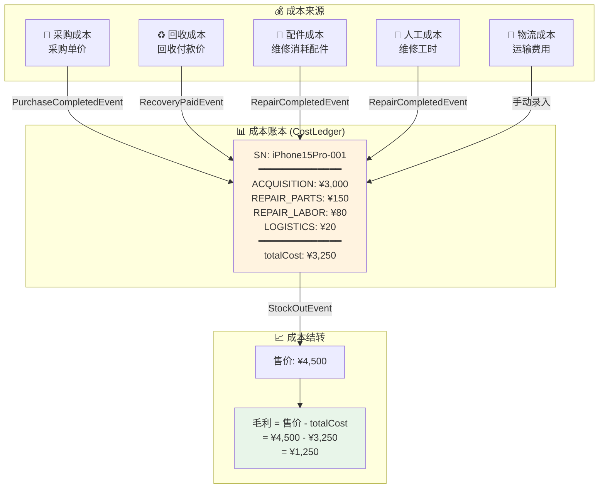
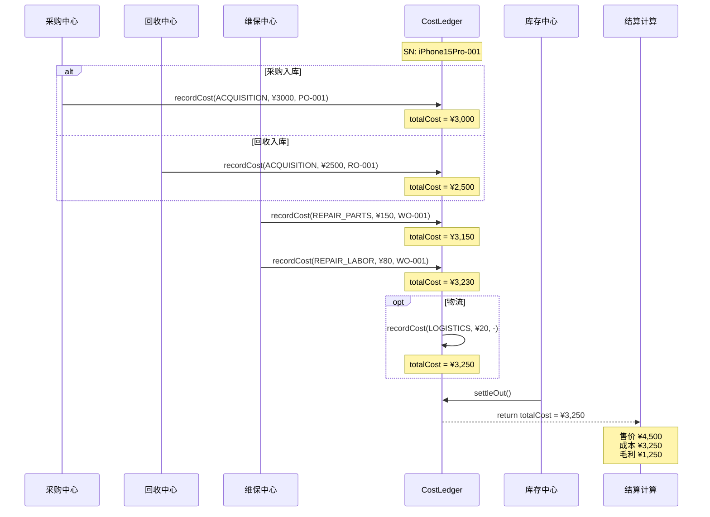

# 成本归集全链路 (Cost Tracking)

> 以 SN 为维度的个别计价法，追踪每一分钱的来源。

## 成本归集流程

## 成本归集时序图

## 成本类型说明

| 成本类型 | 代码 | 来源事件 | 说明 |
| :--- | :--- | :--- | :--- |
| **获取成本** | `ACQUISITION` | PurchaseCompletedEvent / RecoveryPaidEvent | 每个 SN 只有一条，采购价或回收价 |
| **维修配件** | `REPAIR_PARTS` | RepairCompletedEvent | 可多次累加（多次维修） |
| **维修人工** | `REPAIR_LABOR` | RepairCompletedEvent | 可多次累加 |
| **物流运输** | `LOGISTICS` | 手动录入 | 运输/快递费用 |

## 关键业务规则

1. **单调递增**：totalCost 只增不减（不允许删除成本条目）
2. **唯一来源**：每个 SN 只能有一条 ACQUISITION 类型记录
3. **可追溯**：每条 CostEntry 必须关联来源单号 (sourceOrderId)
4. **结转时机**：出库确认 (StockOutEvent) 时执行成本结转
5. **毛利计算**：`毛利 = 实际售价 - settleOut() 返回的 totalCost`
