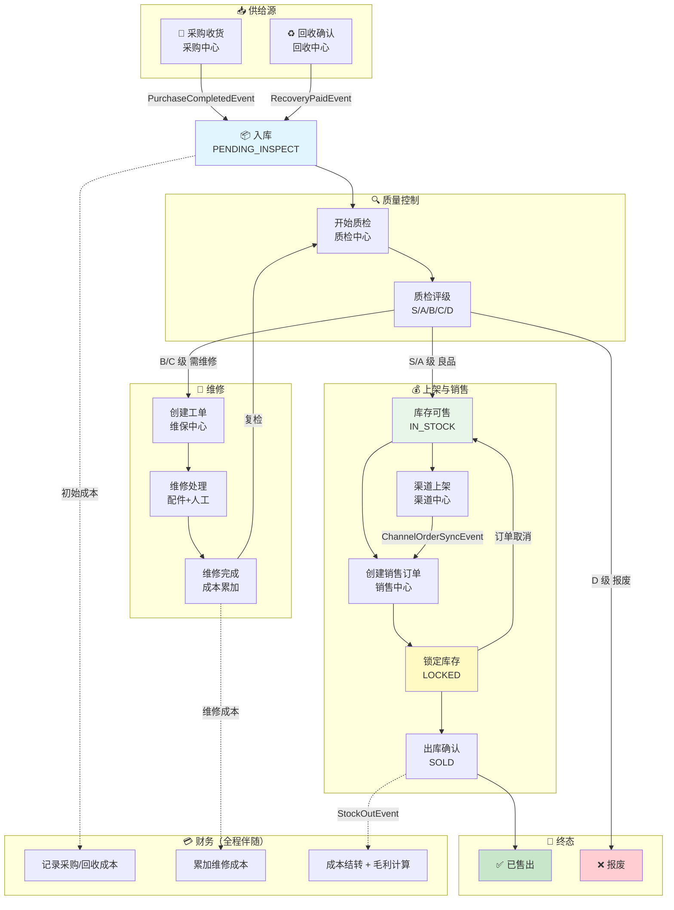

# SN 全生命周期流程 (SN Lifecycle)

> SN (Serial Number) 是系统的核心追踪标识。本图展示一个 SN 从进入系统到离开系统的完整旅程。

## 全链路流程图

## SN 状态与所属上下文对照

| SN 状态 | 所属上下文 | 触发动作 | 下一步 |
| :--- | :--- | :--- | :--- |
| `PENDING_INSPECT` | 库存中心 | 采购/回收入库 | 分配质检 |
| `INSPECTING` | 库存中心 (质检中心操作) | 开始质检 | 评级结果 |
| `IN_STOCK` | 库存中心 | 质检通过 | 上架/锁定 |
| `NEED_REPAIR` | 库存中心 | 质检不通过 | 创建工单 |
| `REPAIRING` | 库存中心 (维保中心操作) | 维修中 | 维修完成 |
| `REPAIRED` | 库存中心 | 维修完成 | 复检 |
| `LOCKED` | 库存中心 | 订单锁定 | 出库/释放 |
| `SOLD` | 库存中心 | 出库确认 | 终态 |
| `SCRAPPED` | 库存中心 | 报废 | 终态 |

## 关键业务规则

1. **入口唯二**：SN 只能通过采购或回收两种方式进入系统
2. **质检必经**：所有新入库的 SN 必须先经过质检
3. **维修可循环**：维修 → 复检 → 维修 可多次循环
4. **锁定排他**：一个 SN 同时只能被一个订单锁定
5. **终态不可逆**：SOLD 和 SCRAPPED 是终态，不可回退
