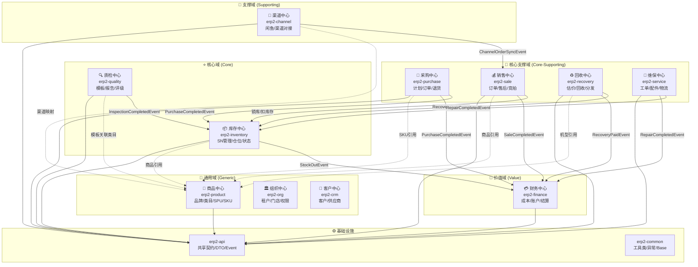

# 限界上下文映射图 (Context Map)

> 本图展示 fprice-erp-saas 系统的所有限界上下文及其关系。

## 全局上下文映射

## 上下文关系类型说明

| 关系 | 上游 (Upstream) | 下游 (Downstream) | 模式 |
| :--- | :--- | :--- | :--- |
| 采购→库存 | Purchase | Inventory | **Customer-Supplier** (事件驱动) |
| 回收→库存 | Recovery | Inventory | **Customer-Supplier** (事件驱动) |
| 质检→库存 | Quality | Inventory | **Customer-Supplier** (事件驱动) |
| 维保→库存 | Service | Inventory | **Customer-Supplier** (事件驱动) |
| 库存→财务 | Inventory | Finance | **Customer-Supplier** (事件驱动) |
| 渠道→销售 | Channel | Sale | **防腐层 (ACL)** — 外部数据格式适配 |
| 所有→商品 | Product | 所有核心域 | **Published Language** (共享 SKU/SPU 定义) |
| 所有→API | erp2-api | 所有模块 | **Shared Kernel** (共享契约) |

## 迭代记录

| 日期 | 变更 | 原因 |
| :--- | :--- | :--- |
| 2026-02-24 | 初始版本 | 基于 erp-model/ARCHITECTURE.md 梳理 |
