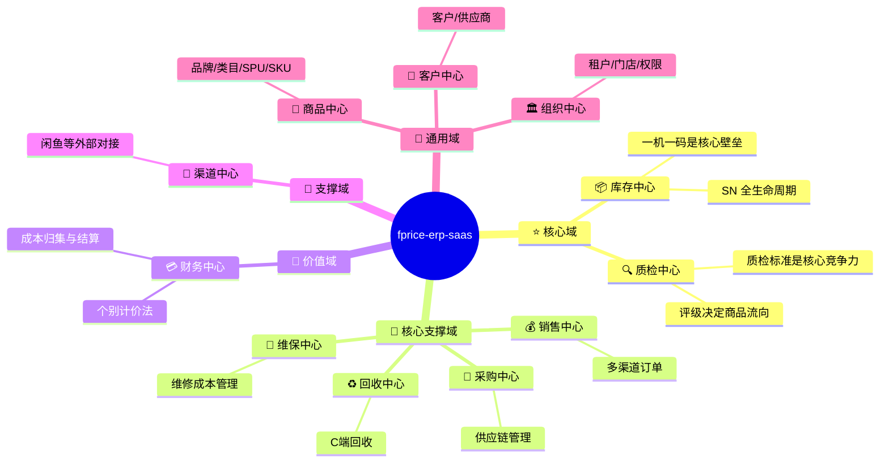
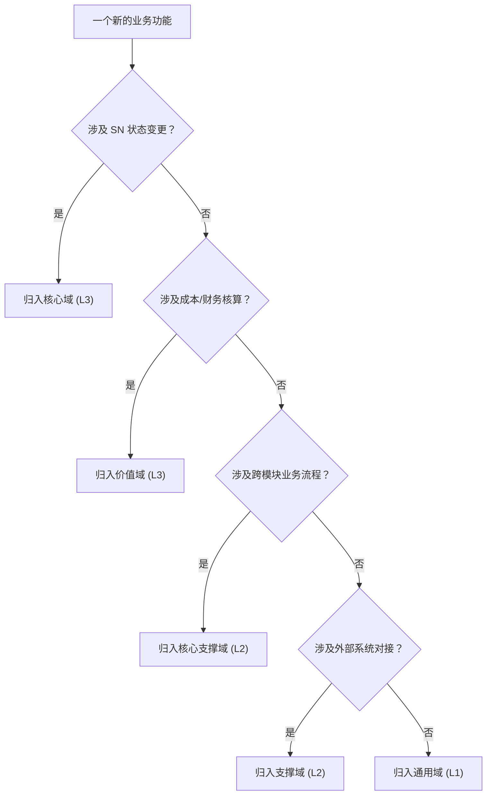

# 域分类 (Domain Classification)

> 按战略重要性对限界上下文进行分类，决定投入的建模深度。

## 分类总览

## 详细分类表

### ⭐ 核心域 (Core Domain) — L3 充血模型

> 核心域是系统的核心竞争力所在，需要最高程度的建模投入。

| 上下文 | 核心聚合根 | 为什么是核心域 | 建模级别 |
| :--- | :--- | :--- | :--- |
| **库存中心** | InventoryItem, Warehouse | SN 级别的库存管理是 3C 数码 ERP 的核心壁垒。状态机复杂（10+ 状态），涉及分布式锁、成本累加等关键逻辑。 | L3 |
| **质检中心** | QualityTemplate, InspectionReport | 质检评级直接决定商品流向（上架/维修/报废），质检标准是区分商品品质的关键能力。 | L3 |

---

### 🔗 核心支撑域 (Core-Supporting Domain) — L2 轻量领域

> 支撑核心域运转的重要业务流程，但业务规则相对标准化。

| 上下文 | 核心聚合根 | 为什么是核心支撑 | 建模级别 |
| :--- | :--- | :--- | :--- |
| **采购中心** | PurchaseOrder, PurchaseReturnOrder | 采购是供应链的入口，但采购流程相对标准（计划→订单→收货）。 | L2 |
| **销售中心** | SalesOrder, AfterSaleOrder | 多渠道销售是营收核心，但订单流程较线性。 | L2 |
| **回收中心** | RecoveryOrder, RecoveryEstimate | 回收是 3C 特有的供给来源，但流程较标准。 | L2 |
| **维保中心** | RepairOrder | 维修影响成本核算，但功能相对独立。 | L2 |

---

### 💎 价值域 (Value Domain) — L3 充血模型

> 承载财务核算的严谨性要求。

| 上下文 | 核心聚合根 | 为什么是价值域 | 建模级别 |
| :--- | :--- | :--- | :--- |
| **财务中心** | CostLedger, FinanceAccount, Settlement | 个别计价法要求每个 SN 独立核算成本。财务数据的一致性和准确性是底线。 | L3 |

---

### 📎 支撑域 (Supporting Domain) — L2 / L1

| 上下文 | 核心聚合根 | 职责 | 建模级别 |
| :--- | :--- | :--- | :--- |
| **渠道中心** | ChannelListing | 外部渠道（闲鱼/拼多多/抖音）的适配层，主要处理数据格式转换。 | L2 |

---

### 🔧 通用域 (Generic Domain) — L1 简单 CRUD

> 标准化程度高，业务逻辑少，可用通用方案实现。

| 上下文 | 主要功能 | 说明 | 建模级别 |
| :--- | :--- | :--- | :--- |
| **商品中心** | 品牌/类目/SPU/SKU 管理 | 数据字典性质，变更不频繁。 | L1 |
| **组织中心** | 租户/门店/权限/系统配置 | 基础运营数据，可用通用 RBAC 方案。 | L1 |
| **客户中心** | 客户/供应商信息 | 联系人管理，逻辑简单。 | L1 |

## 域分类决策树

