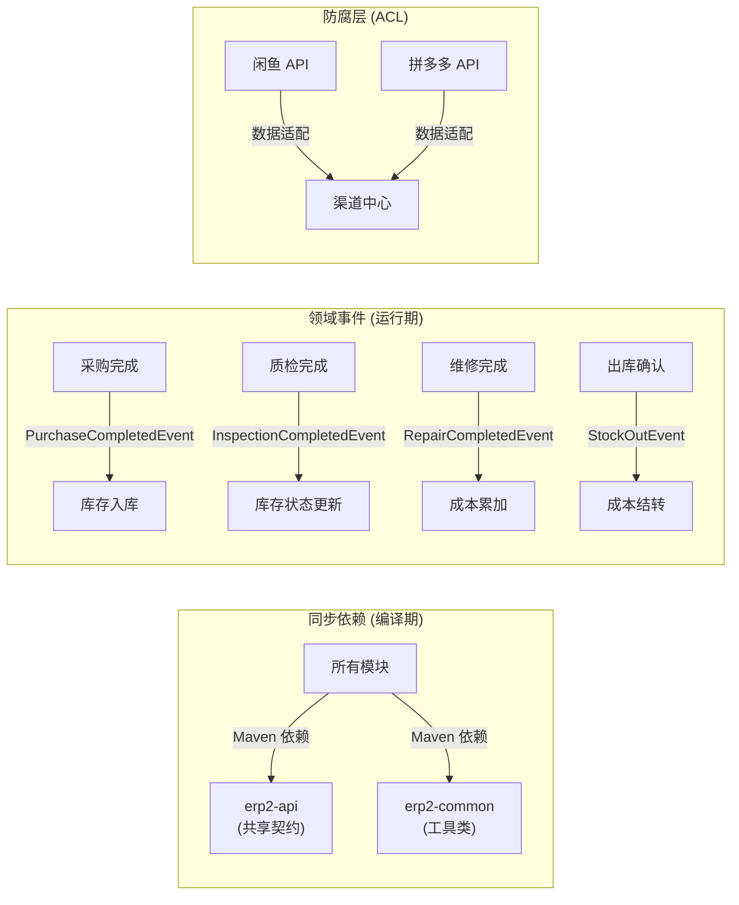
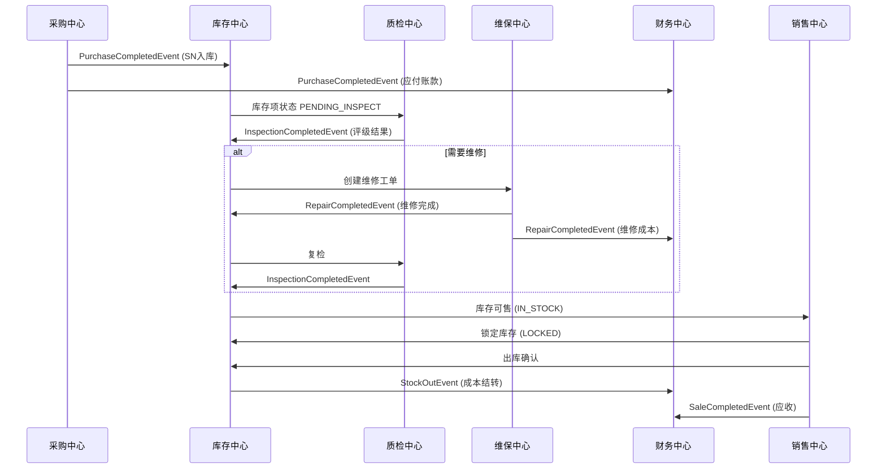

# 上下文集成模式 (Integration Patterns)

> 定义各限界上下文之间的通信方式与数据流转规则。

## 集成方式总览



## 领域事件清单

### 事件发布矩阵

| 事件名 | 发布者 | 消费者 | 触发时机 | 携带数据 |
| :--- | :--- | :--- | :--- | :--- |
| `PurchaseCompletedEvent` | 采购中心 | 库存中心, 财务中心 | 采购订单收货完成 | orderId, items[skuId, snCodes, unitPrices] |
| `InspectionCompletedEvent` | 质检中心 | 库存中心 | 质检报告完成 | snCode, grade, decision(SALE/REPAIR/SCRAP) |
| `RepairCompletedEvent` | 维保中心 | 库存中心, 财务中心 | 维修工单完工 | snCode, repairOrderId, totalRepairCost |
| `RecoveryPaidEvent` | 回收中心 | 库存中心, 财务中心 | 回收付款完成 | orderId, items[skuId, snCode, price] |
| `StockOutEvent` | 库存中心 | 财务中心 | 出库扫码确认 | snCode, orderId, accumulatedCost |
| `SaleCompletedEvent` | 销售中心 | 财务中心 | 销售订单确认收货 | orderId, items[snCode, salePrice] |
| `ChannelOrderSyncEvent` | 渠道中心 | 销售中心 | 外部渠道订单同步 | channelType, channelOrderId, items |

### 事件流转时序图



## 共享内核 (Shared Kernel)

### erp2-api 模块管理策略

`erp2-api` 是所有模块的共享契约层，包含：

| 类型 | 命名约定 | 示例 |
| :--- | :--- | :--- |
| DTO | `Xxx + DTO` | `InventoryItemDTO`, `PurchaseOrderDTO` |
| 命令 | `Xxx + Command` | `StockInCommand`, `CreateOrderCommand` |
| 事件 | `Xxx + Event` | `PurchaseCompletedEvent` |
| 查询 | `Xxx + Query` | `InventoryItemQuery` |
| 值对象 | 与领域层同名 | `SnCode`, `Money`, `SkuId` |

### 修改规则

```
⚠️ 修改 erp2-api 中的任何契约定义前，必须：
1. 评估影响范围（查看哪些模块依赖了该契约）
2. 使用语义版本号思维：
   - 新增字段 → 向后兼容，直接添加
   - 修改/删除字段 → 破坏性变更，需通知所有下游模块
3. 更新 CHANGELOG.md 记录变更
```

## 同步调用 vs 异步事件 决策表

| 场景 | 推荐方式 | 理由 |
| :--- | :--- | :--- |
| 采购收货 → 创建库存项 | **异步事件** | 两个聚合分属不同上下文，不应在同一事务 |
| 销售下单 → 锁定库存 | **同步调用** | 需要即时响应，锁定失败应阻止下单 |
| 维修完成 → 成本记录 | **异步事件** | 成本记录可允许短暂延迟 |
| 查询 SKU 信息 | **同步调用** | 读取操作，无副作用 |
| 渠道订单同步 | **异步事件** | 外部系统数据，需要 ACL 转换 |
