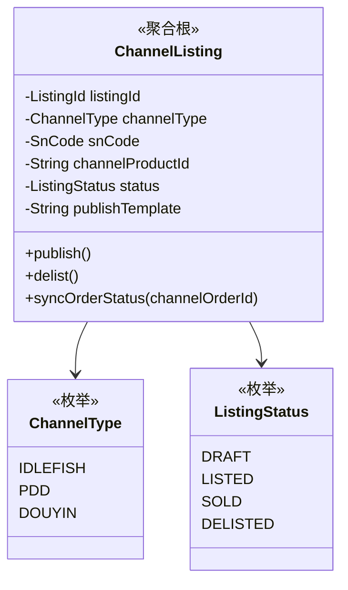
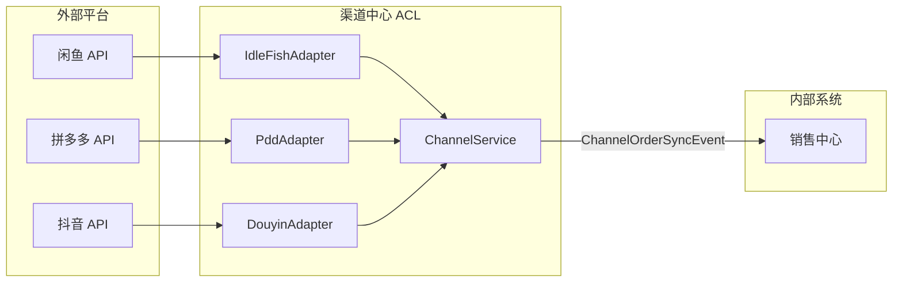

# 🏢 渠道中心 (Channel Context)

> **分类**：📎 支撑域 | **建模级别**：L2 轻量领域
>
> 对接外部销售渠道（闲鱼、拼多多、抖音等），负责数据格式适配和订单同步。

## 职责边界

- ✅ 管理渠道上架（发布/下架商品到外部平台）
- ✅ 同步渠道订单到内部系统
- ✅ 渠道商品映射（内部 SKU ↔ 渠道商品 ID）
- ✅ 渠道结算数据对接
- ❌ 不处理内部库存逻辑
- ❌ 不处理内部订单流程

## 聚合设计

## 防腐层 (Anti-Corruption Layer)

## 领域事件

### 发布的事件

| 事件 | 触发条件 | 消费者 | 携带数据 |
| :--- | :--- | :--- | :--- |
| `ChannelOrderSyncEvent` | 渠道订单同步 | 销售中心 | channelType, channelOrderId, items, buyerInfo |

> 💡 **设计建议**：渠道中心的核心价值在于 ACL（防腐层），将外部平台的各种数据格式统一转换为内部领域模型。每新增一个渠道，只需添加一个新的 Adapter 实现。
