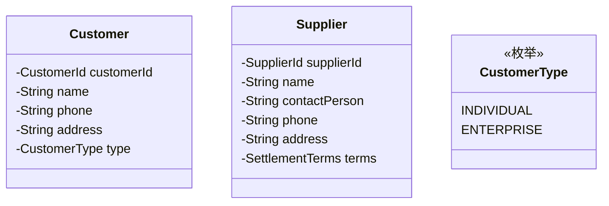

# 👥 客户中心 (CRM Context)

> **分类**：🔧 通用域 | **建模级别**：L1 简单 CRUD
>
> 管理客户和供应商基础信息。

## 职责边界

- ✅ 客户信息管理（买家/C 端用户）
- ✅ 供应商信息管理
- ✅ 联系人管理

## 主要实体

## 被依赖关系

| 依赖方 | 引用的数据 |
| :--- | :--- |
| 采购中心 | SupplierId |
| 销售中心 | CustomerId |
| 回收中心 | CustomerId |

> 💡 **设计建议**：标准 CRUD 模块，使用 MyBatis-Plus 即可。
