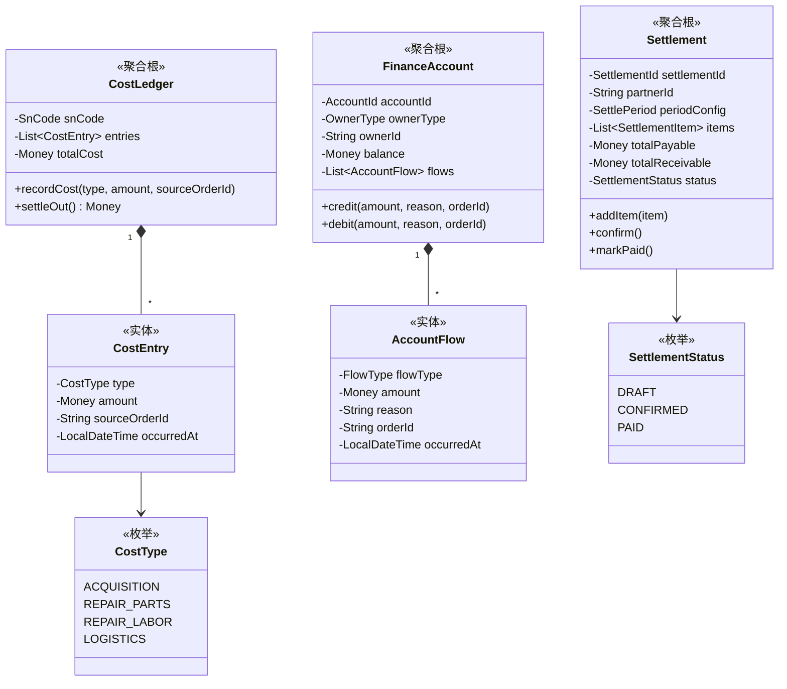
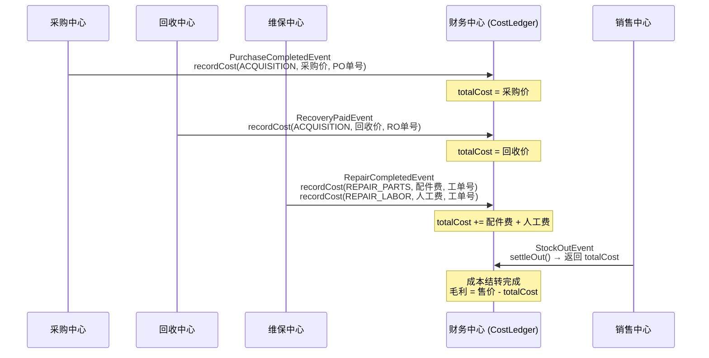
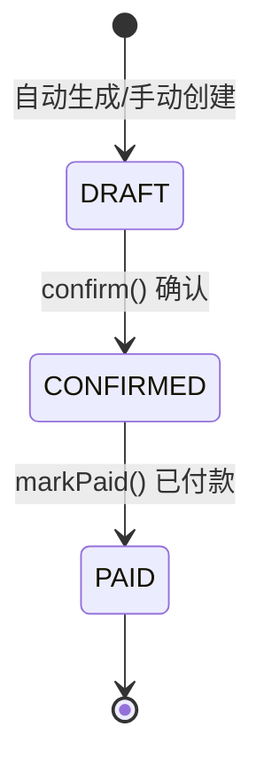

# 💳 财务中心 (Finance Context)

> **分类**：💎 价值域 | **建模级别**：L3 充血模型
> 
> 基于个别计价法，以 SN 为最小单位独立核算成本。承载财务数据的严谨性。

## 职责边界

- ✅ 以 SN 为维度的成本归集与核算
- ✅ 供应商/客户的财务账户与流水管理
- ✅ 周期性结算单的创建与确认
- ❌ 不直接操作库存状态
- ❌ 不直接操作采购/销售订单

## 聚合设计

## 成本归集流程

## 结算单状态

## 领域事件

### 消费的事件

| 事件 | 来源 | 处理逻辑 |
| :--- | :--- | :--- |
| `PurchaseCompletedEvent` | 采购中心 | 为每个 SN 创建 CostLedger，记录采购成本 |
| `RecoveryPaidEvent` | 回收中心 | 为每个 SN 创建 CostLedger，记录回收成本 |
| `RepairCompletedEvent` | 维保中心 | 在对应 SN 的 CostLedger 上追加维修成本 |
| `StockOutEvent` | 库存中心 | 执行成本结转，返回累计成本 |
| `SaleCompletedEvent` | 销售中心 | 生成应收结算项 |

### 发布的事件

当前版本财务中心不主动发布事件。

## 不变量

1. **成本单调递增**：CostLedger.totalCost 只能增加不能减少（特殊冲红场景除外）
2. **账户余额校验**：debit 操作前校验余额充足
3. **结算不可逆**：CONFIRMED 后不可回退到 DRAFT
