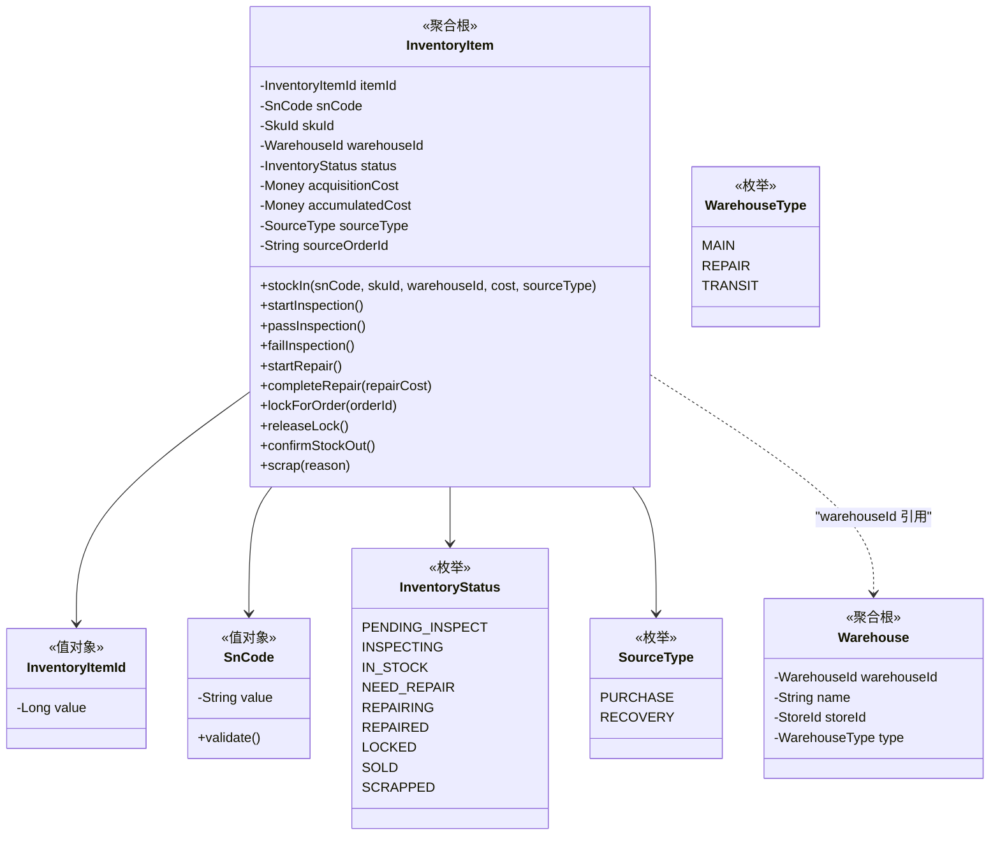
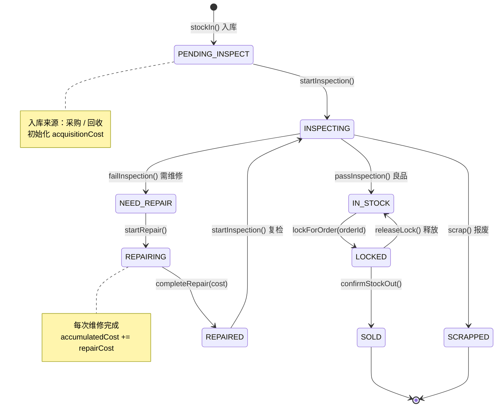

# 📦 库存中心 (Inventory Context)

> **分类**：⭐ 核心域 | **建模级别**：L3 充血模型
> 
> 系统的绝对核心。以 SN 为最小粒度管理每一台设备的全生命周期。

## 职责边界

- ✅ 管理每个 SN 的入库、状态流转、出库
- ✅ 维护 SN 与仓库的归属关系
- ✅ 累计维护每个 SN 的总成本
- ❌ 不负责成本核算逻辑（由财务中心处理）
- ❌ 不负责质检评级逻辑（由质检中心处理）

## 聚合设计

## 状态机

## 领域事件

### 发布的事件

| 事件 | 触发条件 | 消费者 | 携带数据 |
| :--- | :--- | :--- | :--- |
| `StockOutEvent` | confirmStockOut() | 财务中心 | snCode, orderId, accumulatedCost |

### 消费的事件

| 事件 | 来源 | 处理逻辑 |
| :--- | :--- | :--- |
| `PurchaseCompletedEvent` | 采购中心 | 为每个 SN 创建 InventoryItem (PENDING_INSPECT) |
| `RecoveryPaidEvent` | 回收中心 | 为每个 SN 创建 InventoryItem (PENDING_INSPECT) |
| `InspectionCompletedEvent` | 质检中心 | 根据评级更新状态 (IN_STOCK / NEED_REPAIR / SCRAPPED) |
| `RepairCompletedEvent` | 维保中心 | 累加维修成本，状态转为 REPAIRED |

## 不变量 (Invariants)

1. **SN 唯一性**：同一租户下，同一 SN 仅允许存在一条非终态记录
2. **成本累加**：`accumulatedCost = acquisitionCost + Σ repairCosts`
3. **状态守卫**：状态转换必须遵循状态机定义，非法转换抛出 `InvalidStatusTransitionException`
4. **锁定互斥**：LOCKED 状态下不允许被其他订单锁定
5. **分布式锁**：所有状态变更方法必须在分布式锁保护下执行
