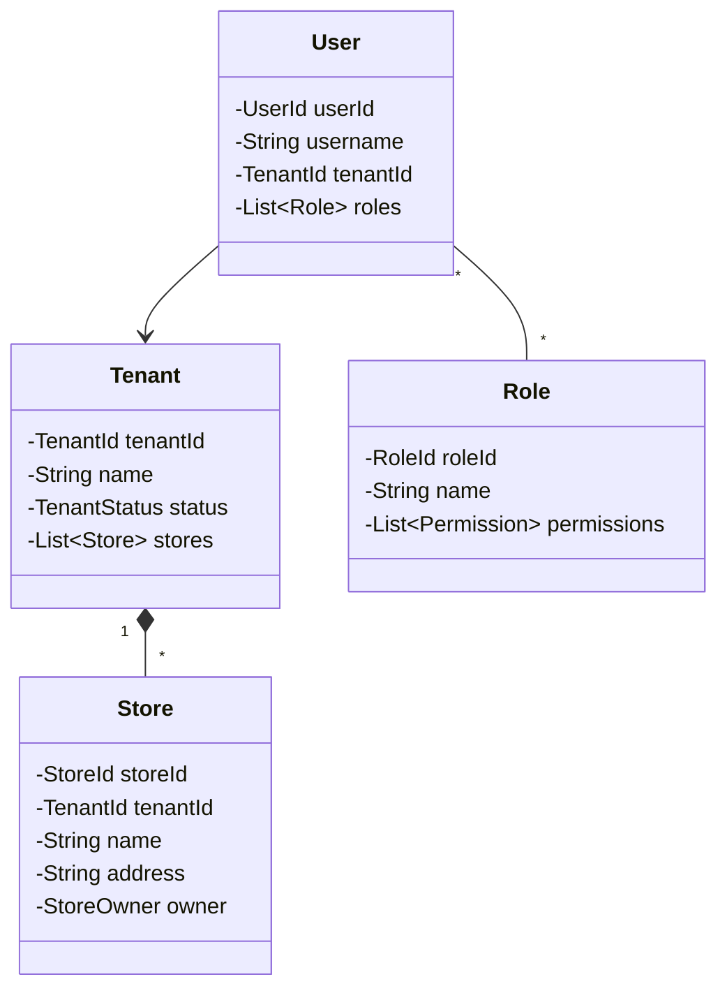

# 🏛️ 组织中心 (Org Context)

> **分类**：🔧 通用域 | **建模级别**：L1 简单 CRUD
>
> 管理 SaaS 租户、门店、权限和系统配置。

## 职责边界

- ✅ 租户管理（多租户隔离）
- ✅ 门店管理
- ✅ 用户角色权限 (RBAC)
- ✅ 系统配置（广告位、快捷方式等）

## 主要实体

## 全局影响

组织中心是所有模块的基础依赖：
- **租户隔离**：所有表包含 `tenant_id`，MyBatis-Plus TenantLineInnerInterceptor 自动过滤
- **审计字段**：`create_by`, `create_time`, `update_by`, `update_time` 自动填充
- **权限控制**：接口级别的 RBAC 校验

> 💡 **设计建议**：可使用成熟的权限框架（如 Sa-Token），不需要从零建模。
