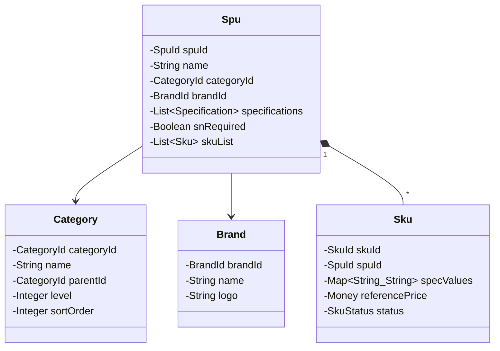

# 📱 商品中心 (Product Context)

> **分类**：🔧 通用域 | **建模级别**：L1 简单 CRUD
>
> 管理品牌、类目、SPU、SKU 等基础商品数据。被所有核心域引用。

## 职责边界

- ✅ 品牌的增删改查
- ✅ 类目树的管理
- ✅ SPU (标品) 的创建与维护
- ✅ SKU (规格组合) 的管理
- ✅ 规格定义与规格值配置
- ❌ 不包含库存逻辑
- ❌ 不包含价格策略

## 主要实体

## 被依赖关系

| 依赖方 | 引用的数据 |
| :--- | :--- |
| 采购中心 | SkuId (采购明细) |
| 库存中心 | SkuId (库存项归属) |
| 质检中心 | CategoryId (质检模板关联类目) |
| 回收中心 | SpuId (回收机型) |
| 销售中心 | SkuId (销售明细) |
| 渠道中心 | SpuId/SkuId (渠道映射) |

> 💡 **设计建议**：商品中心作为通用域，建议直接使用 MyBatis-Plus 的 CRUD，不需要聚合根和领域事件。其他模块通过 SkuId/SpuId 引用即可。
