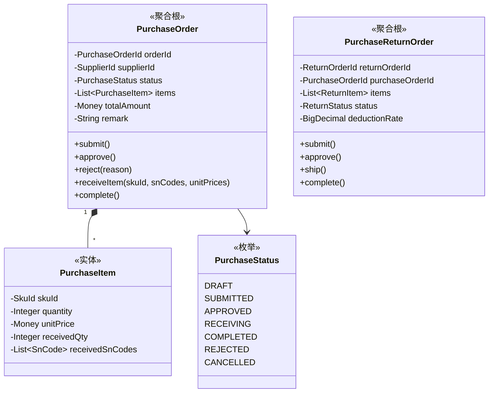
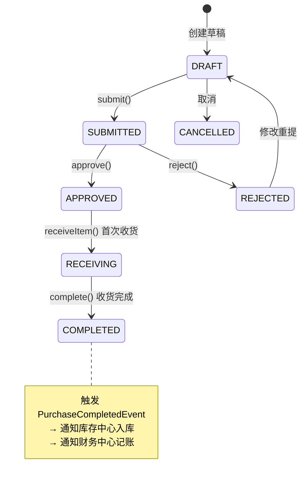

# 🛒 采购中心 (Purchase Context)

> **分类**：🔗 核心支撑域 | **建模级别**：L2 轻量领域
>
> 供应链的入口。管理从采购计划到收货的完整流程。

## 职责边界

- ✅ 创建和管理采购计划与采购订单
- ✅ 管理采购收货流程（逐 SN 收货）
- ✅ 管理采购退货
- ❌ 不直接创建库存项（通过事件通知库存中心）
- ❌ 不直接记录财务（通过事件通知财务中心）

## 聚合设计

## 状态机

## 领域事件

### 发布的事件

| 事件 | 触发条件 | 消费者 | 携带数据 |
| :--- | :--- | :--- | :--- |
| `PurchaseCompletedEvent` | complete() | 库存中心, 财务中心 | orderId, supplierId, items[skuId, snCodes, unitPrices] |

## 不变量

1. **提交校验**：提交时明细不能为空
2. **收货数量**：已收货数量不能超过计划数量
3. **SN 绑定**：每个收货的 SN 必须绑定独立进价
