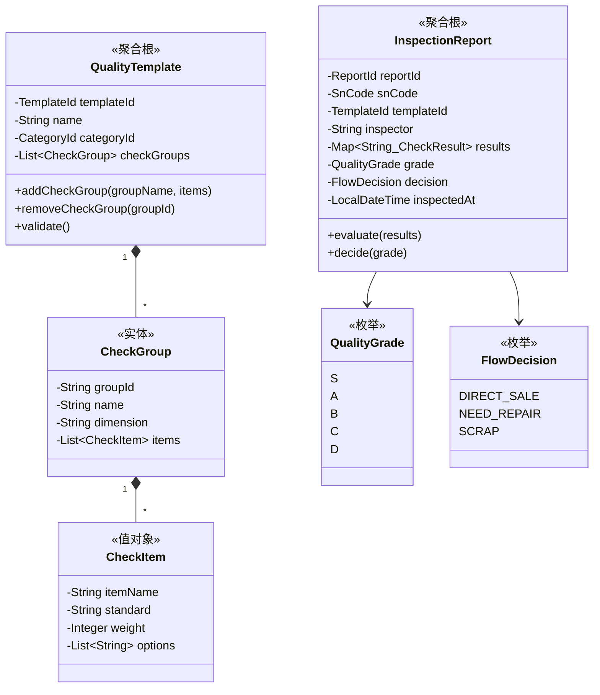
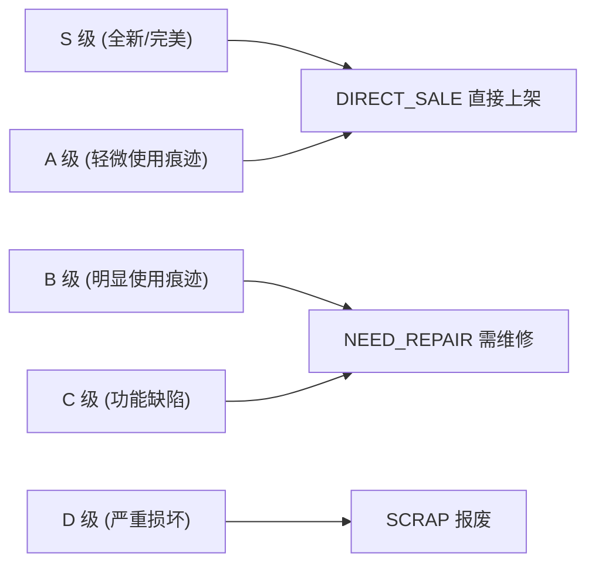

# 🔍 质检中心 (Quality Context)

> **分类**：⭐ 核心域 | **建模级别**：L3 充血模型
> 
> 质检评级直接决定商品流向，质检标准是区分商品品质的核心能力。

## 职责边界

- ✅ 管理质检模板（检测项定义）
- ✅ 执行质检流程，生成质检报告
- ✅ 根据模板规则自动计算评级
- ✅ 决定 SN 的流向（上架/维修/报废）
- ❌ 不直接修改库存状态（通过事件通知库存中心）

## 聚合设计

## 评级→流向映射规则

## 领域事件

### 发布的事件

| 事件 | 触发条件 | 消费者 | 携带数据 |
| :--- | :--- | :--- | :--- |
| `InspectionCompletedEvent` | evaluate() + decide() | 库存中心 | snCode, grade, decision, reportId |

### 消费的事件

无。质检中心不消费其他上下文的事件，而是由库存中心在 SN 进入 INSPECTING 状态时，通过应用服务调用质检中心。

## 不变量

1. **质检完整性**：质检报告必须包含模板中所有检测项的结果
2. **评级不可逆**：一份质检报告一旦评级完成，不可修改（如需重评，创建新报告）
3. **流向确定性**：评级到流向的映射必须是确定性的（S/A→上架，B/C→维修，D→报废）
