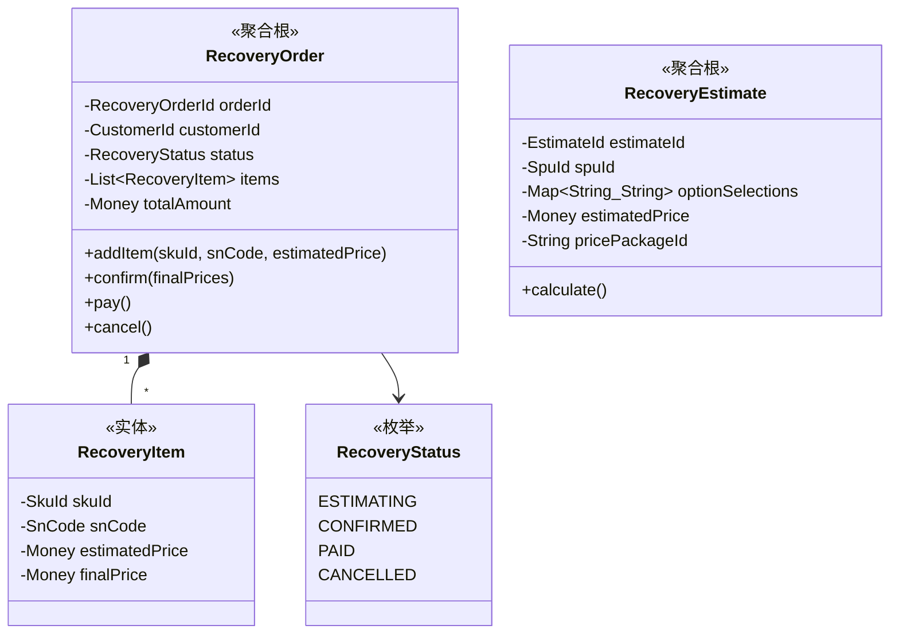
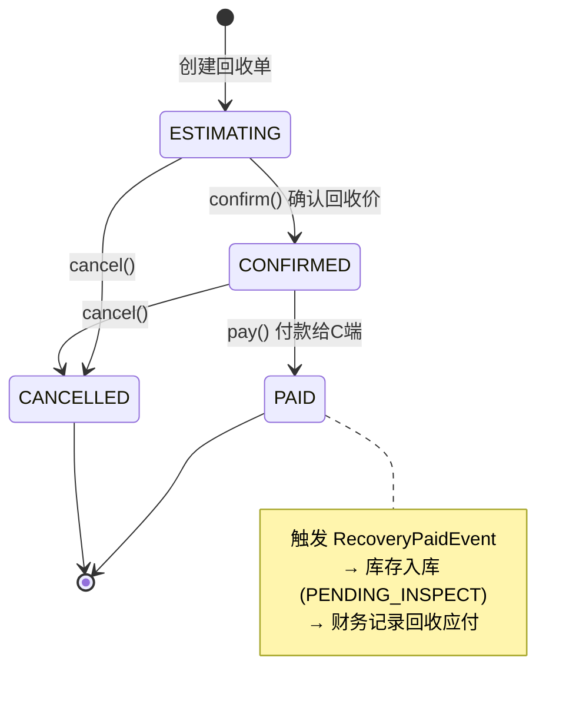

# ♻️ 回收中心 (Recovery Context)

> **分类**：🔗 核心支撑域 | **建模级别**：L2 轻量领域
>
> 3C 数码特有的供给来源。处理从 C 端用户回收二手设备的完整流程。

## 职责边界

- ✅ 管理回收估价（线上/线下）
- ✅ 管理回收订单（确认、付款）
- ✅ 回收品类和机型的配置管理
- ❌ 不直接创建库存项（通过事件通知库存中心）

## 聚合设计

## 状态机

## 领域事件

### 发布的事件

| 事件 | 触发条件 | 消费者 | 携带数据 |
| :--- | :--- | :--- | :--- |
| `RecoveryPaidEvent` | pay() | 库存中心, 财务中心 | orderId, items[skuId, snCode, finalPrice] |
