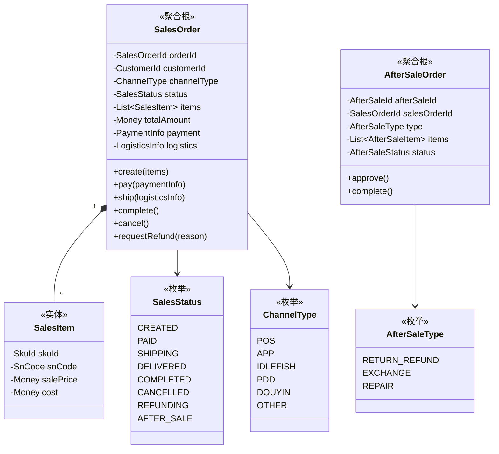
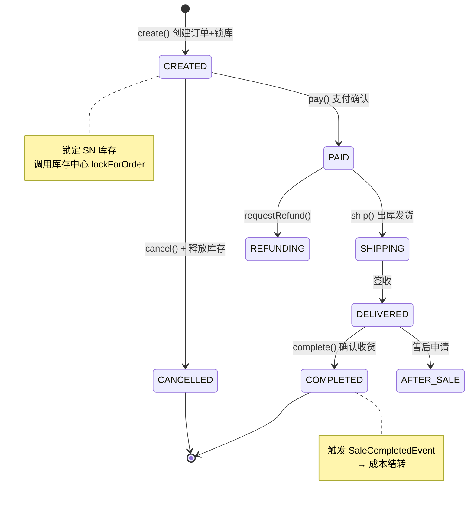

# 💰 销售中心 (Sale Context)

> **分类**：🔗 核心支撑域 | **建模级别**：L2 轻量领域
>
> 多渠道销售订单管理，涵盖前台销售、批量销售、渠道同步。

## 职责边界

- ✅ 管理销售订单的创建、支付、发货、收货
- ✅ 管理售后单（退货退款/换货/维修）
- ✅ 与库存中心协调锁库/出库
- ❌ 不直接操作库存状态
- ❌ 不直接处理渠道对接逻辑（由渠道中心适配）

## 聚合设计

## 状态机

## 领域事件

### 发布的事件

| 事件 | 触发条件 | 消费者 | 携带数据 |
| :--- | :--- | :--- | :--- |
| `SaleCompletedEvent` | complete() | 财务中心 | orderId, items[snCode, salePrice] |

### 消费的事件

| 事件 | 来源 | 处理逻辑 |
| :--- | :--- | :--- |
| `ChannelOrderSyncEvent` | 渠道中心 | 自动创建内部销售订单 |
