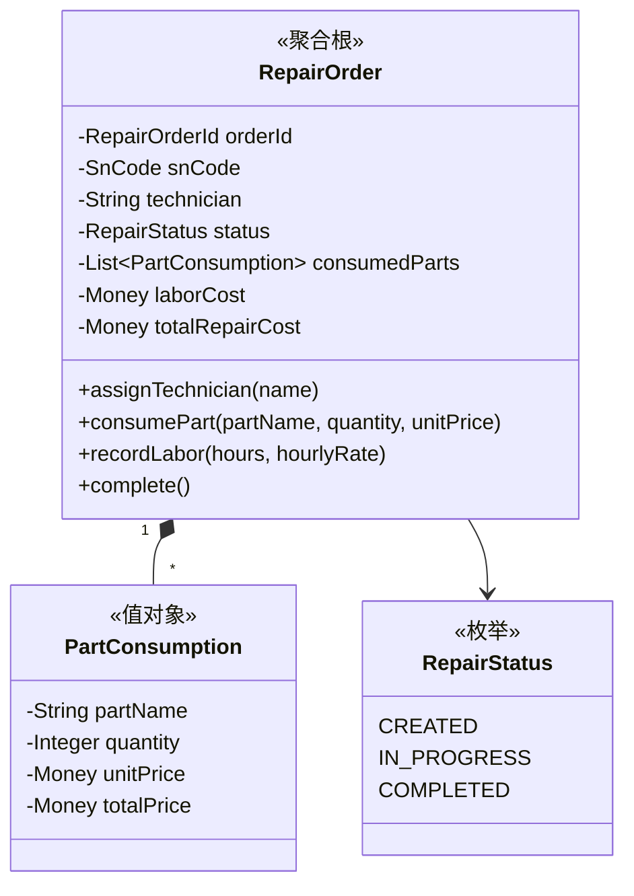
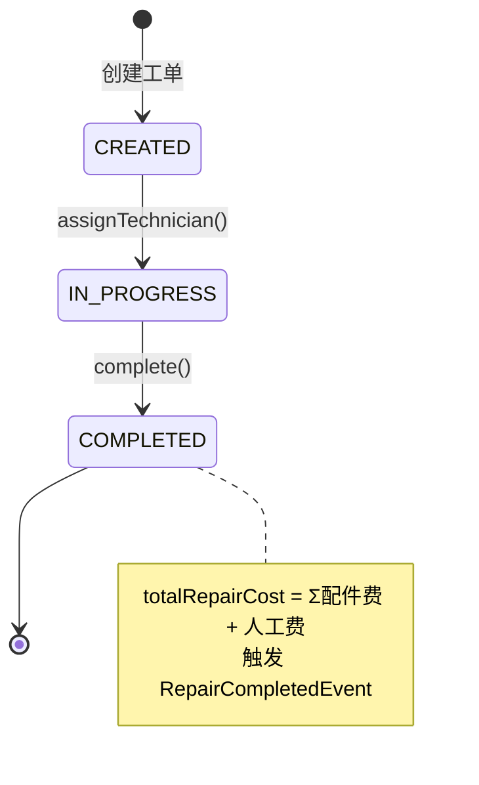

# 🔧 维保中心 (Service Context)

> **分类**：🔗 核心支撑域 | **建模级别**：L2 轻量领域
>
> 管理维修工单的全流程，包括配件消耗和人工成本记录。

## 职责边界

- ✅ 创建和管理维修工单
- ✅ 记录配件消耗与人工成本
- ✅ 触发维修完成事件（通知库存和财务）
- ❌ 不直接修改库存状态
- ❌ 不直接记录财务成本

## 聚合设计

## 状态机

## 领域事件

### 发布的事件

| 事件 | 触发条件 | 消费者 | 携带数据 |
| :--- | :--- | :--- | :--- |
| `RepairCompletedEvent` | complete() | 库存中心, 财务中心 | snCode, repairOrderId, totalRepairCost, consumedParts |

## 不变量

1. **成本完整性**：complete() 前 totalRepairCost 必须 > 0（至少有配件或人工）
2. **技师分配**：IN_PROGRESS 前必须分配技师
