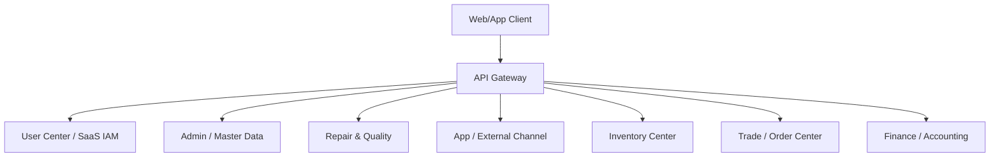

# Technical Design: Microservices Transition & Database Partitioning

This document outlines the strategy for moving from a modular monolith to a distributed microservices architecture for `erp-arch`.

## 1. Service Layering & Gateway

A unified **API Gateway** is essential to abstract the microservice complexity and handle multi-tenant (SaaS) routing.

### 1.1 API Gateway Roles
- **Merchant Routing**: Mapping `tenant_id` from JWT or subdomains to specific service instances if needed.
- **Authentication**: Centralized JWT validation with `tenant_context` propagation.
- **Aggregation (BFF)**: Providing consolidated views for App and Admin clients.
- **Resilience**: Circuit breaking and Rate limiting per tenant.

## 2. Service Definitions (7-Service Model)

To handle high transactional pressure and ensure SaaS scalability, the core has been split:

| Service | Responsibility | DDD Bounded Context |
| :--- | :--- | :--- |
| **erp-iam-service** | Auth, RBAC, **Merchant (Tenant) Onboarding** | Identity & Access |
| **erp-admin-service** | System config, CRM, Product Metadata | Master Data, CRM |
| **erp-channel-service** | External channel proxy (Idlefish, etc.) | Channel Integration |
| **erp-ops-service** | Quality Inspection & Maintenance workflows | Quality, Maintenance |
| **erp-inventory-service**| **SN-level inventory**, Warehouse ops | Inventory |
| **erp-trade-service** | Purchase, Sale, Recovery order lifecycle | Purchase, Sale, Recovery |
| **erp-finance-service** | Cost ledger (**Individual Unit Costing**), Settlement | Finance |

## 3. Database Partitioning Strategy

We follow the **Database-per-Service** pattern. For SaaS, each database supports multi-tenancy via `tenant_id` (Discriminator) or Schemas.

### 3.1 Mapping Schema

| Database | Main Tables | Logic |
| :--- | :--- | :--- |
| **db_iam** | `sys_user`, `sys_tenant`, `sys_role` | Multi-tenant auth foundation. |
| **db_admin** | `crm_client`, `cfg_product_spu`, `cfg_sku` | Shared master data & config. |
| **db_channel** | `chan_mapping`, `idlefish_order_mirror` | External platform data sync. |
| **db_ops** | `ops_quality_report`, `ops_repair_order` | High-volume workflow logs. |
| **db_inventory** | `inv_item_sn`, `inv_stock_log` | High-concurrency SN state engine. |
| **db_trade** | `trade_purchase_order`, `trade_sale_order` | State-heavy order processing. |
| **db_finance** | `fin_ledger`, `fin_settlement` | Audit-grade consistency records. |

### 3.2 Fusion of Business & Technical Split
- **1 Context = 1 Service**: Technical boundaries (services) strictly follow Bounded Contexts to minimize cross-service "chatty" communication.
- **Shared Data**: Use **Data Replication** (MQ) for stagnant data (e.g., SPU names in `db_trade`) to avoid synchronous Joins.
- **Distributed Workflow**: Use **Saga (Orchestration)** for long-running business processes involving multiple services (e.g., Receive -> Inspect -> Putaway).

## 4. Cross-Service Consistency

Since we have a distributed system, we must manage horizontal data consistency.

### 4.1 The SN Uniqueness Challenge
Since SN must be unique per tenant across all services:
- **Global SN Registry**: A lightweight Redis-based registry used by `erp-inventory-service` to claim SNs.
- **Database Constraints**: `inv_item_sn` table in `db_inventory` uses a unique index on `(tenant_id, sn)`.

### 4.2 Distributed Transactions
- **Transactional Outbox**: Ensure MQ events are reliably published after DB commits.
- **Saga Pattern**: Used for complex flows. Example:
    1. `Trade Service`: Submit Sales Order -> `OrderCreated` Event.
    2. `Inventory Service`: Listen to `OrderCreated` -> Lock SN -> `SNLocked` Event.
    3. `Trade Service`: Listen to `SNLocked` -> Update Order Status.

### 4.3 Data Synchronization
- **Event-Driven Cache**: Services listen to Master Data events (e.g., `ProductPriceUpdated`) to update their local caches or redundant fields.
