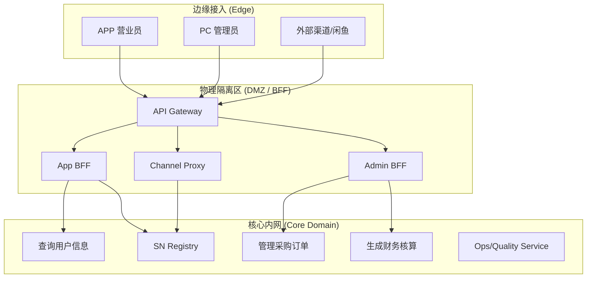

# 融合架构设计：业务与技术的统一方案 (Fusion Architecture)

> 本文档旨在探讨如何将“技术维度（内外网/渠道）”与“业务维度（领域模型/DDD）”进行有机融合，构建一套既能满足安全隔离、多端适配，又能保证业务逻辑统一的分布式架构。

## 1. 核心痛点与挑战

在大型 ERP 系统设计中，常有两种划分路线：
1.  **技术/物理视角**：按内外网隔离、APP/PC 管理端拆分。优点是安全可控，缺点是业务逻辑（如入库、质检）容易在多端重复实现，导致“逻辑泥潭”。
2.  **业务/逻辑视角**：按 DDD 限界上下文（库存、贸易、财务）拆分。优点是核心逻辑唯一，缺点是对多端差异（APP 极简、PC 复杂）的适配成本较高，且难直接体现物理网络隔离诉求。

## 2. 三层弹性架构方案 (Three-Layer Elastic Architecture)

我们提出一种“**业务沉淀中心，技术适配边缘**”的三层架构，以融合上述两个维度：

### 2.1 第一层：接入网关层 (Infrastructure/Gateway)
*   **定位**：系统的物理边界与入口。
*   **职责**：
    *   **流量分发**：识别请求来源（APP、WEB、WebHook）。
    *   **安全防护**：DDoS 防护、黑白名单、多租户（SaaS）上下文识别。
    *   **协议路由**：将外部统一请求转发至对应的 BFF 模块。

### 2.2 第二层：BFF 适配层 (Backend for Frontend - 技术维度)
*   **定位**：专为特定客户端或渠道定制的轻量级后端。
*   **职责**：
    *   **数据聚合 (Fan-out)**：APP 首页需要展示“姓名+订单数+待质检数”，由 BFF 并行调用 IAM、Trade、Ops 服务并合并数据。
    *   **协议转换**：对接外部渠道（如闲鱼、转转）的非标接口，映射为内部标准模型。
    *   **按需裁剪**：过滤掉冗余字段，优化移动端网络开销。
*   **部署策略**：可根据“内外网隔离”要求，将 BFF 部署在特定网段（如 DMZ），作为进入核心内网的安全跳板。

### 2.3 第三层：核心领域层 (Domain Services - 业务维度)
*   **定位**：业务逻辑的唯一来源与资产重心。
*   **职责**：
    *   **逻辑封闭**：处理纯粹的领域规则（如：SN 状态变更、财务核算、库存锁定）。
    *   **数据隔离**：每个领域服务拥有独立数据库。
*   **部署策略**：部署在严格保护的内网环境，仅接受 BFF 或内部服务的调用。

---

## 3. 架构视图 (Architecture View)

## 4. 该方案的优势 (Why this works?)

1.  **均衡性**：通过 BFF 层解决了“按多端/网段分”的技术诉求，通过领域层解决了“按业务逻辑分”的质量诉求。
2.  **安全性**：核心数据库与核心逻辑始终处于内网，不直接暴露给任何客户端，BFF 层起到了天然的安全隔离带作用。
3.  **敏捷性**：前端 UI 的变化只需在 BFF 层灵活适配，不影响底层的稳定业务模型；而底层业务规则的优化也能一次性生效于所有端。

## 5. 总结

这种“技术适配在前，业务核心在后”的设计思想，本质上是将**物理部署单元**与**逻辑建模单元**进行了解耦。在实际落地中，我们可以根据团队规模和业务复杂度，先在单体中划出 BFF 模块，再逐步演进为独立部署的 BFF 微服务。
