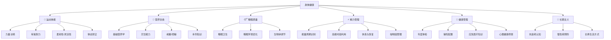

# 💪 身体健康能力域 — 基座

> 身体是一切的载体。没有健康，其他所有能力域的分值都要打折。

## 为什么这是"基座"而不只是一个能力域

```
你的精力 = 你的生产力上限
你的体力 = 你的抗压能力上限
你的睡眠质量 = 你的认知能力质量
你的健康 = 你能享受财富的年限

一个亚健康的人，所有能力域都在 0.7x 运行。
一个精力充沛的人，所有能力域都在 1.3x 运行。
```

## 能力树



## 各等级标准

### L1 — 忽视型
- 不运动或极少运动
- 经常熬夜，睡眠不规律
- 饮食以外卖为主
- 没有体检习惯
- 经常感到疲惫

### L2 — 有意识
- 每周运动 1-2 次
- 基本能做到 12 点前睡
- 开始关注饮食健康
- 每年体检 1 次
- 知道自己身体的基本问题

### L3 — 有习惯
- 每周运动 3-4 次（力量+有氧）
- 稳定的作息（11:30 前睡，7:00 起）
- 自己下厨比例 > 50%
- 了解基础营养学
- 精力充沛，工作效率高

### L4 — 有系统
- 有完整的训练计划（力量+有氧+柔韧性）
- 睡眠质量监测和优化
- 营养搭配有意识管理
- 了解并实践"精力管理"
- 能在高压期间保持身体状态

### L5 — 生活方式
- 运动和健康饮食已是生活方式
- 了解长寿和抗衰老的前沿知识
- 心理健康和身体健康同步关注
- 能影响周围人的健康意识
- 70 岁时仍能保持活力

---

## 程序员的身体问题清单

> 💀 这些是你的"技术债"，越早还越好

| 问题 | 原因 | 解决方案 | 紧迫度 |
|------|------|---------|--------|
| 颈椎/腰椎问题 | 久坐 | 站立办公+每小时活动 | 🔴 |
| 近视加深/干眼 | 长时间盯屏幕 | 20-20-20法则 | 🔴 |
| 体重超标 | 久坐+外卖 | 力量训练+控制饮食 | 🟡 |
| 睡眠障碍 | 熬夜/蓝光/咖啡因 | 睡眠卫生+生物钟 | 🟡 |
| 精力不足 | 不运动+营养不良 | 运动+蛋白质+铁 | 🟡 |
| 焦虑/抑郁倾向 | 高压+社交少 | 运动+社交+必要时就医 | 🔴 |

---

## 精力管理四象限

> 精力不是"省着用"，而是"会充电"

```
        高精力
          ↑
    创造区 | 行动区
   (深度工作) | (会议/社交)
  ─────────┼──────────→ 高刺激
    恢复区 | 消耗区
   (冥想/散步) | (刷手机/焦虑)
          ↓
        低精力
```

### 精力管理日程
| 时段 | 精力状态 | 最佳用途 | 禁止事项 |
|------|---------|---------|---------|
| 早晨 6-9 | 🔋🔋🔋 最高 | 最重要的深度工作 | 刷手机/开会 |
| 上午 9-12 | 🔋🔋 高 | 核心工作 | 闲聊 |
| 午后 13-15 | 🔋 低谷 | 机械性工作/小憩 | 重要决策 |
| 下午 15-18 | 🔋🔋 回升 | 协作/社交/学习 | 新的深度任务 |
| 晚间 19-21 | 🔋 中 | 副业/学习 | 高认知任务 |
| 睡前 21-23 | 🔋 低 | 轻松阅读/复盘 | 蓝光/咖啡因 |

---

## 最小可行健康方案（从今天开始）

> 不需要去健身房，不需要请私教，从最小的改变开始

### 第 1 周：3 个微改变
1. **睡前放下手机** — 设闹钟提醒，手机放客厅充电
2. **每天走 6000 步** — 午饭后散步 15 分钟
3. **喝够 2L 水** — 准备一个水瓶放桌上

### 第 2-4 周：加入运动
4. **每天 10 分钟拉伸** — 对抗久坐（B 站搜"办公室拉伸"）
5. **每周 2 次力量训练** — 从俯卧撑/深蹲开始
6. **减少外卖** — 至少做到 1 天 1 餐自己做

### 第 2-3 月：建立系统
7. **完整的训练计划** — 建议：3 天力量 + 2 天有氧
8. **营养追踪** — 用 App 记录 1 周的饮食
9. **年度体检** — 安排一次全面体检

---

## 我的当前状态

- **当前等级**：L_
- **身体问题清单**：
  - [ ] 
  - [ ] 
  - [ ] 
- **运动习惯**：每周 ___ 次
- **睡眠状况**：平均 ___:___ 入睡，___:___ 起床
- **饮食状况**：外卖比例 ___%
- **精力自评(1-10)**：___
- **下一步行动**：
  1. 
  2. 
  3. 
