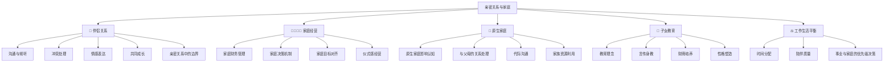

# ❤️ 亲密关系与家庭能力域

> 赚再多钱，如果最亲的人和你离心，人生就没有基本盘。

## 为什么这个能力域不能缺

```
事业是你的前台，家庭是你的后台。
后台崩了，前台再漂亮也是空壳。

很多人创业失败不是能力不够，是后院起火。
很多人赚到了钱但不幸福，是因为丢了最重要的人。
```

## 能力树



## 各等级标准

### L1 — 被动型
- 关系靠惯性维持
- 不善于表达情感
- 常因忙碌忽略家人
- 和伴侣沟通少/有矛盾

### L2 — 有意识
- 知道关系需要经营
- 能感知到伴侣/家人的需求
- 开始安排家庭时间
- 有改善的意愿

### L3 — 有能力
- 有效的沟通模式（能表达需求 + 能倾听）
- 冲突发生时能理性处理
- 家庭有共同目标和规划
- 工作和家庭基本平衡

### L4 — 有系统
- 家庭有定期沟通机制（家庭会议）
- 伴侣之间有共同成长计划
- 家庭财务透明，有中长期规划
- 在事业拼搏的同时维护高质量关系

### L5 — 幸福家庭
- 家庭是你最大的后盾和充电站
- 伴侣是你最好的合伙人/支持者
- 孩子从你身上学到了最好的品质
- "有了家，走得更远"

---

## 创业者/高压工作者的特别挑战

| 挑战 | 常见后果 | 解决方案 |
|------|---------|---------|
| 时间极度不够 | 伴侣抱怨、孩子疏远 | 高质量陪伴 > 低质量的长时间 |
| 情绪带回家 | 冲突升级 | 进门前 5 分钟"角色切换" |
| 赚钱变唯一目标 | 家人只感受到压力 | 每周分享你的进展和感受 |
| 伴侣不理解你的事业 | 冷战、不支持 | 把TA当合伙人一样沟通 |
| 忽略原生家庭 | 愧疚感累积 | 每周一通电话，每月一次看望 |

### 几条铁律
1. **再忙也不能断的事**：每天和伴侣认真聊 15 分钟
2. **每周至少有一天是"家庭日"** — 不看手机、不想工作
3. **大决策必须和伴侣对齐** — 创业/投资/移民都是家庭决策
4. **永远让家人知道他们比钱重要** — 用行动证明，不只是说

---

## 亲密关系沟通技巧

### 非暴力沟通四步法（NVC）
1. **观察**（不带评判）："这周你加了五天班"
2. **感受**："我感到孤独/被忽略"
3. **需求**："因为我需要被陪伴的感觉"
4. **请求**："你能不能这周六陪我半天？"

### 情感账户
> 把关系想象成一个银行账户

| 存款行为 💰 | 取款行为 💸 |
|-----------|-----------|
| 认真倾听 | 心不在焉 |
| 记住重要日子 | 忘记纪念日 |
| 主动帮忙做家务 | 觉得理所当然 |
| 肯定和赞美 | 批评和抱怨 |
| 一起做决定 | 自作主张 |
| 身体接触/拥抱 | 冷漠疏远 |

> ⚠️ 情感账户的规则：**取款的伤害力是存款的 5 倍**。一次大吵可能抹掉 20 次好行为。

---

## 原生家庭认知

### 你从原生家庭继承了什么？

| 维度 | 父母的模式 | 你继承了吗？ | 想保留还是改变？ |
|------|----------|-----------|-------------|
| 金钱观 | | 是/否 | |
| 沟通方式 | | 是/否 | |
| 冲突处理 | | 是/否 | |
| 情感表达 | | 是/否 | |
| 教育方式 | | 是/否 | |
| 安全感来源 | | 是/否 | |

> [!NOTE]
> 认识原生家庭的影响不是为了"甩锅"，而是为了**有意识地选择**你要继承什么、改变什么。

---

## 我的当前状态

- **当前等级**：L_
- **伴侣关系满意度(1-10)**：___
- **家庭时间投入**：每周 ___ 小时
- **最大的关系痛点**：
- **原生家庭影响最大的模式**：
- **下一步行动**：
  1. 
  2. 
  3. 
