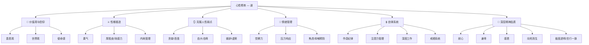

# 🧘 心性修炼能力域 — 道

> 术让你走得快，道让你走得远。所有技能的天花板，都由你的心性决定。

## 核心理念

```
一个懒惰的人学不好投资。
一个胆小的人做不好社交。
一个贪婪的人守不住财富。
一个情绪不稳的人管不好团队。

心性，是所有能力域的"操作系统"。
```

## 能力树



---

## 一、🧭 价值观与信仰

### 善恶光谱自我定位

> 不是非黑即白。真正的成熟是理解灰色地带，但有自己的底线。

| 维度 | 光谱 | 你的位置 | 理想位置 |
|------|------|---------|---------|
| 善良-邪恶 | 纯善 ← → 纯恶 | | |
| 秩序-混乱 | 严格秩序 ← → 完全自由 | | |
| 利他-利己 | 牺牲自我 ← → 极端自私 | | |
| 诚实-欺骗 | 绝对诚实 ← → 随意欺骗 | | |

**关键洞察**：
- 善良不是软弱，是有能力伤害但选择不伤害
- 有原则的灰色 > 无底线的黑 > 无能的白
- 底线要清晰、不可动摇；底线之上可以灵活

### 世界观构建

你如何理解以下概念？（写下你真实的想法，不是"正确答案"）

| 概念 | 你现在的理解 | 你想达到的理解 |
|------|------------|-------------|
| 金钱 | | |
| 权力 | | |
| 人际关系 | | |
| 成功 | | |
| 失败 | | |
| 公平 | | |
| 运气 | | |

### 人生信仰锚点

> 当一切都崩塌的时候，你还相信什么？

- 我相信：_______________________
- 我活着的意义是：_______________
- 我绝不妥协的是：_______________
- 驱动我前进的根本动力是：_______

---

## 二、⚔️ 性格锻造

### 勇气培养

> 勇气不是不害怕，而是害怕了还去做。

**勇气评估**

| 场景 | 你会怎么做？ | 理想状态 | 差距 |
|------|------------|---------|------|
| 被不合理要求时 | 默默接受 / 委婉拒绝 / 直接说不 | 直接说不 | |
| 和客户/老板谈加薪 | 不敢提 / 暗示 / 直接谈 | 用数据直接谈 | |
| 发现商业机会但有风险 | 观望 / 犹豫 / 快速行动 | 评估后果断行动 | |
| 公开场合发言 | 逃避 / 紧张发挥 / 自信表达 | 自信表达 | |
| 面对批评和质疑 | 自我怀疑 / 辩解 / 平静回应 | 评估是否有道理后回应 | |

**勇气训练法**：
1. **每日一拒** — 每天做一件让你感到轻微不舒服的事
2. **恐惧日记** — 记下你害怕的事，然后去做其中最小的一件
3. **公开承诺** — 把目标公开告诉别人，逼自己执行
4. **冷水浴** — 每天用冷水收尾，训练面对不适的能力

### 厚脸皮训练

> 你的"脸皮厚度"决定了你能承受多大的市场。

**为什么程序员特别需要练厚脸皮**：
- 技术出身的人习惯了"正确答案"，害怕犯错
- 代码的世界非黑即白，但商业世界充满灰色和被拒绝
- 被拒绝了不是你不好，是时机/场景不对

**训练计划**：

| 阶段 | 练习 | 频率 | 不适指数 |
|------|------|------|---------|
| 第1周 | 在餐厅向陌生人搭话 | 每天1次 | ⭐⭐ |
| 第2周 | 主动向别人推荐自己的产品/服务 | 每天1次 | ⭐⭐⭐ |
| 第3周 | 主动要求打折/免费升级 | 每天1次 | ⭐⭐⭐ |
| 第4周 | 在社交场合主动自我介绍 | 每周3次 | ⭐⭐⭐⭐ |
| 持续 | 收集100次"不" — 把被拒绝当作游戏 | 持续 | ⭐⭐⭐⭐⭐ |

### 敏感性管理

> 敏感不是缺点，管理不好的敏感才是。

**敏感的正面用法**：
- 洞察力 — 比别人更快发现机会和风险
- 共情力 — 更容易理解用户需求和客户痛点
- 审美力 — 对产品体验更有感觉

**敏感的管理方法**：
1. **区分事实和感受** — "他说的话让我不舒服"≠"他在攻击我"
2. **延迟反应** — 给自己 24 小时缓冲，不在情绪中做决定
3. **建立保护层** — 不是所有反馈都值得认真对待
4. **能量管理** — 高敏感人群需要定期独处充电

### 钝感力修炼

> 对无关紧要的负面信息自动过滤

| 需要钝感力的场景 | 错误反应 | 正确反应 |
|----------------|---------|---------|
| 网上被人喷 | 生气反驳 | 不看/不回/拉黑 |
| 朋友无意的玩笑 | 暗自生气好几天 | 一笑而过 |
| 工作被批评 | 自我怀疑 | 提取有用信息，忽略情绪攻击 |
| 和别人比较 | 焦虑自卑 | 收集信息，制定自己的计划 |

---

## 三、🪞 克服人性弱点

### 贪婪管控

```
贪婪的本质：永远觉得不够。
管控的目标：知道"够了"在哪里。
```

**练习**：
- [ ] 设定明确的"满足点"（投资回报率达到 X% 就止盈）
- [ ] 延迟满足训练（想买的东西等 7 天再决定）
- [ ] 每月做一次"够了清单"（列出你已经拥有的好东西）
- [ ] 认识到贪婪的信号（心跳加速、"错过就没了"的感觉）

### 小气 → 大方

```
小气的本质：稀缺心态 — 觉得给出去就少了
大方的本质：富足心态 — 觉得给出去会回来更多
```

**训练**：
- [ ] 每月做一次"战略性大方"（请人吃饭/送礼/分享资源）
- [ ] 记录每次大方行为带来的回报（往往超出预期）
- [ ] 把钱当作工具而不是安全感来源
- [ ] 学习"利他即利己"的商业逻辑

### 懒惰 → 自律

```
懒惰的本质：短期快感 > 长期收益
自律的本质：让正确的事情变得容易
```

**不要靠意志力，靠系统**：
1. **环境设计** — 把手机放另一个房间，把书放枕头旁
2. **最小行动法** — "写一页" 而不是"写一本书"
3. **习惯绑定** — 把新习惯绑定到已有习惯上
4. **进度可视化** — 打卡日历、连续天数计数器
5. **奖惩机制** — 完成奖励自己，失败惩罚自己（发红包）

### 恐惧 → 行动

**恐惧清单法**：

| 编号 | 我害怕的事 | 最坏结果 | 最坏结果的概率 | 我能承受吗 | 行动？ |
|------|----------|---------|-------------|----------|--------|
| 1 | | | | 是/否 | |
| 2 | | | | 是/否 | |
| 3 | | | | 是/否 | |

**渐进脱敏**：
- 第 1 步：写下来（把恐惧具体化）
- 第 2 步：小规模尝试（用最小代价试错）
- 第 3 步：复盘（发现"没那么可怕"）
- 第 4 步：加大剂量

### 嫉妒 → 学习

```
嫉妒的正面理解：嫉妒告诉你"你的欲望在哪里"
转化方法：把嫉妒的对象变成"目标参照物"
```

- [ ] 发现嫉妒时，问自己："他做了什么我可以学？"
- [ ] 建立"标杆人物清单"，分析他们的关键决策
- [ ] 接受"目前差距"的事实，把注意力放在"缩小差距"上

---

## 四、🌊 情绪管理

### 情绪觉察与标记

> 能命名情绪，就能管理情绪。

**日常情绪记录表**（每日花 2 分钟）：

| 时间 | 事件 | 情绪 | 强度(1-10) | 我的反应 | 更好的反应 |
|------|------|------|-----------|---------|-----------|
| | | | | | |

**基础情绪词汇表**：
- 愤怒类：恼怒、生气、暴怒、委屈、不满
- 恐惧类：担心、焦虑、惊恐、不安、紧张
- 悲伤类：失望、沮丧、悲伤、自卑、孤独
- 开心类：满足、兴奋、自豪、感激、平静

### 三种最影响成事的负面情绪

#### 1. 愤怒管理
- **6 秒法则** — 愤怒时数 6 秒再反应，杏仁核的激活只有 6 秒
- **换位思考** — "他这样做可能是因为..."
- **运动释放** — 跑步、拳击等身体消耗

#### 2. 焦虑应对
- **焦虑公式**：焦虑 = 不确定性 × 重要性 ÷ 控制感
- **降低方法**：增加信息 → 降低不确定性；拆解行动 → 增加控制感
- **接受不完美** — "做了 60 分比想着 100 分不做强"

#### 3. 自卑突破
- **区分"暂时不行"和"永远不行"** — 大部分技能都是可以学的
- **证据收集法** — 列出你做成功的事情，驳斥"我不行"
- **小赢积累** — 设定一些容易完成的目标，积累自信

### 正念冥想入门

| 阶段 | 时间 | 方法 | 频率 |
|------|------|------|------|
| 入门 | 5分钟 | 专注呼吸 | 每天起床后 |
| 进阶 | 10分钟 | 身体扫描 | 每天 |
| 熟练 | 15-20分钟 | 开放觉察 | 每天 |

推荐 App：潮汐、小睡眠、Headspace

---

## 五、🔒 自律系统

### 基础纪律

> 这是你的"操作系统"底层，崩溃了上面什么都跑不了

| 纪律 | 最低标准 | 理想标准 | 当前状态 |
|------|---------|---------|---------|
| 睡眠 | 11:30 前睡 | 11:00 前睡 | |
| 起床 | 7:30 前起 | 7:00 前起 | |
| 运动 | 每周 2 次 | 每周 4 次 | |
| 饮食 | 少外卖 | 自己做饭 | |
| 手机 | < 4 小时/天 | < 2 小时/天 | |

### 注意力管理与深度工作

- **番茄钟**：25 分钟深度工作 + 5 分钟休息
- **注意力黑洞**：识别你最容易浪费时间的 3 个地方
  1. 
  2. 
  3. 
- **深度时间块**：每天保证至少 2 小时不被打扰的深度时间

### 戒瘾系统

| 成瘾行为 | 日均时间 | 目标时间 | 替代行为 | 策略 |
|----------|---------|---------|---------|------|
| 短视频 | ___分钟 | ___分钟 | | |
| 游戏 | ___分钟 | ___分钟 | | |
| 社交媒体刷新 | ___分钟 | ___分钟 | | |
| 其他 | ___分钟 | ___分钟 | | |

**戒瘾策略**：
1. **增加摩擦** — 删除首页入口、设置时间限制
2. **替换回路** — 用建设性活动替代（刷视频 → 听播客）
3. **奖励重设** — 完成深度工作后才能刷手机
4. **进度追踪** — 每天记录，建立"连续不碰"的成就感

### 延迟满足训练

| 阶段 | 练习 | 时长 |
|------|------|------|
| 第 1 周 | 想买的东西等 3 天再买 | 3 天 |
| 第 2 周 | 饿了坚持到饭点再吃 | 几小时 |
| 第 3 周 | 想刷手机时先完成 1 个任务 | 30 分钟 |
| 第 4 周 | 想回复消息时等 1 小时 | 1 小时 |
| 持续 | 投资收益不到目标不取出 | 几个月-年 |

---

## 六、🌸 深层精神品质

> 这些品质没有速成法，需要年为单位的修炼。但它们是你人格大厦的地基，缺失了任何一块，上面的楼都会歪。

### 耐心（Patience）

```
耐心是所有伟大事业的前提。
种一棵树最好的时间是十年前，其次是现在。
但种下之后——你只能等。
```

**程序员特别缺耐心的原因**：
- 代码写完就能看到结果 → 习惯了"即时反馈"
- 人生中大部分重要的事（投资/人脉/修身）都是"延迟反馈"

**耐心训练**：
| 练习 | 说明 | 周期 |
|------|------|------|
| 种一盆植物 | 每天浇水，看它慢慢长 | 持续 |
| 写日记 30 天 | 不追求"有用"，只追求"坚持" | 30天 |
| 定投不看收益 | 设好后 3 个月不打开 App | 3个月 |
| 学一个慢技能 | 书法/画画/乐器 — 不可能速成 | 半年+ |
| 读一本 500 页的书 | 不跳读，逐页读完 | 1-2月 |

### 谦卑（Humility）

```
真正的谦卑不是觉得自己不行，
而是知道自己行，但也知道别人行。
```

**谦卑自检清单**：
- [ ] 上一次真心说"我不知道"是什么时候？
- [ ] 上一次向比你年轻/资历浅的人请教是什么时候？
- [ ] 你是否在某个领域因为懂了一点就觉得什么都懂？
- [ ] 你是否在心里看不起某些人/行业？
- [ ] 你是否经常打断别人说话？

**谦卑的价值**：
- 谦卑让你继续学习 → 不谦卑让你停止成长
- 谦卑让人愿意帮你 → 傲慢让贵人绕道走
- 谦卑让你看到盲区 → 自大让你撞上盲区

### 感恩（Gratitude）

```
感恩不是鸡汤，是对抗"永远不够"的解药。
贪婪让你焦虑，感恩让你平静。
二者平衡，才能既有野心又有幸福。
```

**每日感恩练习**（2 分钟，建议睡前）：

| 日期 | 今天感恩的 3 件事 | 感恩的 1 个人 |
|------|----------------|-------------|
| | 1. <br/>2. <br/>3. | |

**深层感恩反思**（每月一次）：
- 如果我失去健康，我最怀念现在的什么？
- 如果我从未遇见 ___，我的人生会怎样？
- 哪些"理所当然"的事其实并不理所当然？

### 接纳与放下（Acceptance & Letting Go）

```
接纳不是认命，是不和现实较劲。
放下不是放弃，是释放不能控制的事。

你的人生 = 10% 发生了什么 + 90% 你如何回应
```

**需要接纳的事（写下来）**：

| 我无法改变的事实 | 我对此的情绪 | 我可以控制的部分 |
|---------------|-----------|-------------|
| | | |
| | | |
| | | |

**放下清单**：
- [ ] 过去犯的错 → 写下教训，然后翻篇
- [ ] 别人对我的评价 → 我的价值不由他人定义
- [ ] 不公平的经历 → 总结经验，向前看
- [ ] 完美主义 → "足够好"就去做
- [ ] 控制欲 → 只关注影响圈内的事

### 向死而生（Memento Mori）

```
如果你只剩 1 年的寿命，你还会做现在正在做的事吗？
如果不会——为什么还在做？
```

> 这是最古老、也最强大的精神修炼工具。斯多葛学派、佛教、存在主义哲学都以此为核心。

**向死而生练习**：
1. **遗书练习** — 如果明天就是最后一天，你想留下什么话？写下来。（每年做一次）
2. **墓志铭练习** — 你希望墓碑上写什么？那就是你真正的人生目标。
3. **5 年倒计时** — 假设只剩 5 年，列出你一定要做的 10 件事。
4. **死亡冥想（5分钟）** — 想象你 80 岁回顾一生，你最骄傲/最后悔的是什么？

**核心启示**：
- 时间是唯一真正不可再生的资源
- 大部分让你焦虑的事，在"死亡"面前都不值一提
- 越早面对死亡，越能活出真实的自己

### 言行一致（Integrity）

```
言行一致是信任的唯一来源。
信任是最慢建立、最快摧毁的资产。
```

**自检**：
| 维度 | 你说了什么 | 你做了什么 | 一致吗？ |
|------|----------|----------|---------|
| 对自己的承诺 | "明天开始锻炼" | | |
| 对伴侣的承诺 | | | |
| 对同事的承诺 | | | |
| 对朋友的承诺 | | | |
| 你的价值观 vs 实际行为 | "我重视健康" | 每天外卖+熬夜 | |

**建立整合性的方法**：
1. **少承诺，多兑现** — 只承诺你 100% 能做到的事
2. **对自己的承诺也算承诺** — 爽约自己 = 训练自己不可靠
3. **说到做到哪怕代价很大** — 短期亏损换长期信用
4. **承认失败** — 做不到就老实说，比找借口强

### 慈悲心（Compassion）

```
慈悲不是圣母心，是理解每个人都有自己的困难。
慈悲不是软弱，是有力量之后的温柔。
```

**慈悲心和商业的关系**：
- 理解别人的痛苦 → 发现商业机会（痛点 = 需求）
- 对员工有慈悲 → 团队忠诚度更高
- 对客户有慈悲 → 口碑和复购
- 对竞争对手有慈悲 → 格局更大，不纠缠

**慈悲心练习**：
1. **慈心冥想** — 祝福自己、亲人、朋友、陌生人、你不喜欢的人
2. **换位练习** — 下次生别人的气时，先想"如果我是他，处在他的处境..."
3. **每月一善** —做一件不求回报的善事（帮陌生人/捐赠/义务指导）
4. **善待服务者** — 对外卖员/保安/清洁工说谢谢

---

## 等级标准

### L1 — 无意识
- 被情绪和欲望驱动
- 不知道自己的弱点是什么
- 没有自律习惯

### L2 — 有意识
- 知道自己的弱点
- 开始尝试自律但不稳定
- 能觉察情绪但管理不了

### L3 — 有方法
- 有稳定的作息和习惯
- 能在大部分时候控制情绪
- 有明确的价值观和底线
- 勇气和厚脸皮有明显提升

### L4 — 有系统
- 自律已成习惯，不需要意志力
- 情绪稳定，高压下不崩溃
- 能影响他人的价值观和行为
- 延迟满足成为本能

### L5 — 已内化
- 心性修炼已成为生活方式
- 在关键时刻能做出违反人性但正确的决策
- 被人评价为"靠谱""心态好""有格局"
- 内心平和但不失锐气

---

## 我的当前状态

- **当前等级**：L_
- **最大弱点**（诚实面对）：
- **最需要突破的性格问题**：
- **过去一个月的情绪波动**：
- **自律执行情况**：
  - 做到了：
  - 没做到：
- **下一步行动**：
  1. 
  2. 
  3. 
