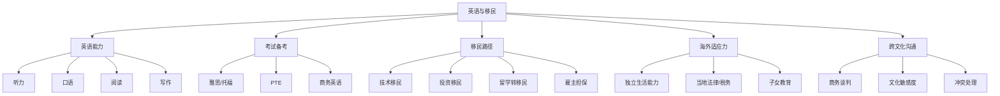

# 🌍 英语与移民能力域

> 语言是通往另一个世界的钥匙，移民是给人生多一个选择。

## 能力树

## 各等级标准

### L1 小白
- ✅ 能读懂简单网页
- ❌ 不能进行日常对话
- ❌ 对移民路径一无所知

### L2 入门
- ✅ 能进行简单日常英语对话
- ✅ 能看英文技术文档
- ✅ 了解 2-3 种移民路径
- ❌ 雅思预计 < 5.0

### L3 熟练
- ✅ 雅思 6.0-6.5 或同等水平
- ✅ 能参加英文技术面试
- ✅ 日常英语交流无障碍
- ✅ 已确定移民目标国家
- ✅ 了解目标国家的移民要求

### L4 精通
- ✅ 雅思 7.0+ 或同等水平
- ✅ 能用英语进行商务谈判
- ✅ 已启动移民申请流程
- ✅ 有海外生活经验（留学/工作）

### L5 大师
- ✅ 英语接近母语水平
- ✅ 已获得海外身份（PR/公民）
- ✅ 能帮助他人规划移民路径
- ✅ 跨文化工作自如

---

## 热门移民路径分析（程序员视角）

| 国家 | 路径 | 英语要求 | 资金门槛 | 时间线 | 适合程度 |
|------|------|---------|---------|--------|---------|
| 🇨🇦 加拿大 | 技术移民(EE) | 雅思 6-7 | 低 | 1-2年 | ⭐⭐⭐⭐⭐ |
| 🇦🇺 澳大利亚 | 技术移民 | 雅思 6-7 | 低 | 1-3年 | ⭐⭐⭐⭐ |
| 🇳🇿 新西兰 | 技术移民 | 雅思 6.5 | 低 | 1-2年 | ⭐⭐⭐⭐ |
| 🇺🇸 美国 | EB1/EB2 | 中 | 中 | 2-5年 | ⭐⭐⭐ |
| 🇸🇬 新加坡 | EP/PEP | 低 | 中 | 1-2年 | ⭐⭐⭐⭐ |
| 🇯🇵 日本 | 高度人才 | 低(日语) | 低 | 1-3年 | ⭐⭐⭐ |

### 推荐学习路径
1. **英语基础**：每日 30 分钟（播客 + Anki + 口语练习）
2. **雅思备考**：3-6 个月集中冲刺
3. **移民研究**：确定 2 个目标国家，加入相关社群
4. **实地考察**：旅游签证先去体验

---

## 我的当前状态

- **当前等级**：L_
- **英语水平**：
  - 听力：___
  - 口语：___
  - 阅读：___
  - 写作：___
- **目标国家**：
- **计划移民路径**：
- **下一步行动**：
  1. 
  2. 
  3. 
