# 🚀 创业能力域

> 创业不是冲动的产物，是一系列可学习能力的组合。

## 能力树

```mermaid
graph TD
    ROOT[创业能力] --> A[商业洞察]
    ROOT --> B[产品能力]
    ROOT --> C[营销与销售]
    ROOT --> D[资本运作]
    ROOT --> E[运营管理]
    ROOT --> F[法务合规]

    A --> A1[市场机会识别]
    A --> A2[商业模式设计]
    A --> A3[竞争分析]
    A --> A4[定价策略]
    
    B --> B1[用户需求洞察]
    B --> B2[MVP快速验证]
    B --> B3[产品迭代]
    B --> B4[用户体验]
    
    C --> C1[内容营销]
    C --> C2[社交媒体运营]
    C --> C3[销售技巧]
    C --> C4[渠道建设]
    C --> C5[品牌建设]
    
    D --> D1[融资能力]
    D --> D2[财务管理]
    D --> D3[现金流管理]
    D --> D4[投资人关系]
    
    E --> E1[流程优化]
    E --> E2[供应链管理]
    E --> E3[数据驱动决策]
    
    F --> F1[公司注册/股权]
    F --> F2[合同法务]
    F --> F3[知识产权]
    F --> F4[税务合规]
```

## 各等级标准

### L1 小白
- ✅ 想过要创业
- ✅ 看过一些创业故事
- ❌ 没有尝试过任何形式的生意
- ❌ 不了解基本的商业概念

### L2 入门
- ✅ 做过副业/小生意（哪怕亏了）
- ✅ 了解基本的商业模式类型
- ✅ 注册过公司或个体工商户
- ❌ 没有持续盈利的项目

### L3 熟练
- ✅ 有至少 1 个持续盈利的项目
- ✅ 有小团队管理经验
- ✅ 能做基本的财务分析
- ✅ 有销售/营销的实战经验

### L4 精通
- ✅ 有 1+ 个成功的商业项目
- ✅ 年营收 100W+
- ✅ 有融资或投资人对接经验
- ✅ 能识别和验证新的商业机会
- ✅ 有品牌影响力

### L5 大师
- ✅ 连续创业者或行业领袖
- ✅ 有成功退出/IPO 经验
- ✅ 能孵化/指导其他创业者
- ✅ 有投资组合

---

## 程序员的创业优势与陷阱

### ✅ 优势
1. **技术实现能力** — 别人花 50W 外包的东西你自己能做
2. **产品思维基础** — 理解技术可行性，避免空中楼阁
3. **数据驱动习惯** — 用数据说话，不凭感觉
4. **AI 时代红利** — AI 让个人开发者能力 10x 放大

### ⚠️ 常见陷阱
1. **只做不卖** — 花 80% 时间写代码，0% 时间做营销
2. **技术完美主义** — 追求代码优雅，忽略市场验证
3. **害怕销售** — 觉得"好产品会自己说话"
4. **单打独斗** — 不愿合伙，不敢分钱，什么都自己做

### 程序员创业路径

| 路径 | 启动成本 | 风险 | 收入天花板 | 适合阶段 |
|------|---------|------|-----------|---------|
| 接私活/外包 | 零 | 低 | 年入 50W | 起步期 |
| 知识付费（课程/咨询） | 低 | 低 | 年入 100W | 有积累后 |
| SaaS/独立产品 | 中 | 中 | 年入 500W+ | 有余力后 |
| AI 应用/工具 | 低-中 | 中 | 年入 1000W+ | 现在！ |
| 平台型创业 | 高 | 高 | 亿级 | 有资源后 |

---

## 在中国创业的实操建议

### 低成本验证清单
1. **不辞职创业** — 先做副业验证
2. **先卖再做** — 先收到钱/预订/意向再开发
3. **找竞品学习** — 不要做"世界上没有的产品"
4. **找到第一个付费用户** — 这是最重要的里程碑

### 中国市场的机会方向（2026）
1. **AI + 垂直行业** — 用 AI 解决某个行业的具体问题
2. **出海（Cross-border）** — 中国供应链 + 海外市场
3. **本地生活服务** — 下沉市场仍有空间
4. **B2B SaaS** — 中小企业数字化
5. **内容电商** — 抖音/小红书/视频号

---

## 我的当前状态

- **当前等级**：L_
- **创业经验**：
- **正在做/想做的项目**：
- **最大短板**：
- **下一步行动**：
  1. 
  2. 
  3. 
