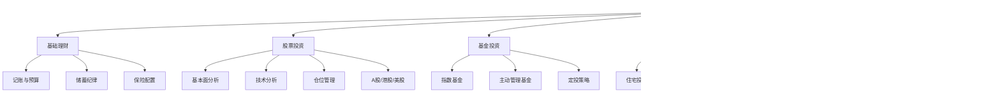

# 💰 理财投资能力域

> 让钱为你工作，而不是你为钱工作。

## 能力树

## 各等级标准

### L1 小白
- ✅ 知道要理财
- ✅ 有储蓄账户
- ❌ 不知道如何选择投资品
- ❌ 没有记账习惯

### L2 入门
- ✅ 每月固定储蓄 20%+
- ✅ 配置了基础保险（医疗+重疾）
- ✅ 用过余额宝/银行理财
- ✅ 尝试过买基金
- ❌ 没有成熟的投资体系

### L3 熟练
- ✅ 有清晰的资产配置比例
- ✅ 定投指数基金 1 年以上
- ✅ 有股票账户并实盘操作过
- ✅ 能读懂财报基础指标
- ✅ 年化收益率稳定 > 通胀

### L4 精通
- ✅ 有完整的投资体系（入场/加仓/止盈/止损）
- ✅ 多市场投资（A股+港股/美股）
- ✅ 投资收益是重要的收入来源
- ✅ 能给别人投资建议
- ✅ 有房产投资或其他另类投资经验

### L5 大师
- ✅ 投资收益 = 主要收入来源
- ✅ 有天使投资/私募投资经验
- ✅ 有系统化的投资方法论并可输出
- ✅ 管理资产规模 500W+

---

## 在中国做投资的关键认知

### 必须理解的规则
1. **政策就是最大的基本面** — A 股受政策驱动远大于基本面
2. **房产的金融属性在减弱** — 不要用过去 20 年的经验预测未来
3. **人民币资产要对冲** — 必须有美元/港币计价的资产
4. **税收差异是机会** — 了解不同投资品的税收政策

### 推荐学习路径
1. **读 3 本书**：《小狗钱钱》→《聪明的投资者》→《穷查理宝典》
2. **开户实操**：A 股 + 港股通 + 美股账户
3. **定投半年**：沪深 300 + 纳斯达克 100
4. **建立体系**：定义买入/卖出规则，写下来并执行

---

## 我的当前状态

- **当前等级**：L_
- **最大短板**：
- **下一步行动**：
  1. 
  2. 
  3. 
- **学习资源**：
