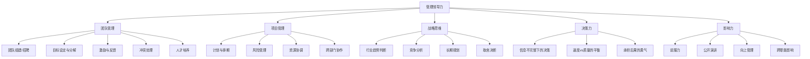
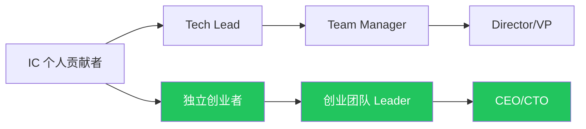

# 👔 管理领导力能力域

> 从"自己做事"到"带人做事"再到"让系统做事"。

## 能力树

## 各等级标准

### L1 小白
- ✅ 能管理好自己的工作
- ❌ 没有带团队经验
- ❌ 不擅长分配任务和跟进

### L2 入门
- ✅ 带过 2-3 人的小团队
- ✅ 能做基本的任务分配
- ✅ 有项目管理工具经验
- ❌ 对"管人"vs"管事"的区别不清楚

### L3 熟练
- ✅ 管理过 5-10 人团队
- ✅ 能独立负责一个项目从 0 到 1
- ✅ 会做团队的目标设定和绩效评估
- ✅ 能处理团队内部冲突

### L4 精通
- ✅ 管理过 10+ 人或多团队
- ✅ 有战略规划能力（年度/季度）
- ✅ 能招聘、培养和淘汰团队成员
- ✅ 有跨部门/跨公司协作经验
- ✅ 能做困难决策并承担后果

### L5 大师
- ✅ 管理过公司级别组织
- ✅ 能建立管理体系和文化
- ✅ 有培养管理者的能力
- ✅ 行业内有管理影响力

---

## 从程序员到管理者的成长路径

### 关键转变
| 从 | 到 | 心态转变 |
|----|-----|---------|
| 自己做 | 让别人做 | 放下"我做更快"的执念 |
| 追求完美 | 追求结果 | 80 分及时交付 > 100 分延期 |
| 技术思维 | 业务思维 | 问"为什么做"比"怎么做"更重要 |
| 被安排 | 做安排 | 主动设定方向，而不是等任务 |
| 关注细节 | 关注全局 | 抓大放小，信任团队 |

---

## 我的当前状态

- **当前等级**：L_
- **管理经验**：
- **最大障碍**：
- **下一步行动**：
  1. 
  2. 
  3. 
