# 🧠 底层心智模型能力域

> 聪明人和普通人的区别不是智商，是思维模型。

## 为什么需要这个能力域

```
技能是"做什么"，心智模型是"怎么想"。
同样的信息摆在面前，不同的思维模型会得出完全不同的结论。
这是最耗时、也最值钱的底层能力 — 因为它提升所有其他能力域的效率。
```

## 能力树

```mermaid
graph TD
    ROOT[底层心智模型] --> A[🔄 系统思维]
    ROOT --> B[🎲 概率思维]
    ROOT --> C[🪞 元认知]
    ROOT --> D[🔍 批判性思维]
    ROOT --> E[📐 决策框架]
    ROOT --> F[🌀 复杂性思维]

    A --> A1[因果链分析]
    A --> A2[反馈回路识别]
    A --> A3[二阶效应思考]
    A --> A4[系统涌现认知]
    
    B --> B1[贝叶斯更新]
    B --> B2[期望值计算]
    B --> B3[风险vs不确定性]
    B --> B4[幸存者偏差识别]
    
    C --> C1[认知偏见觉察]
    C --> C2[邓宁-克鲁格自检]
    C --> C3[知道自己不知道什么]
    C --> C4[学习如何学习]
    
    D --> D1[逻辑谬误识别]
    D --> D2[信息源评估]
    D --> D3[独立思考能力]
    D --> D4[反直觉思维]
    
    E --> E1[可逆vs不可逆决策]
    E --> E2[机会成本思维]
    E --> E3[沉没成本识别]
    E --> E4[后悔最小化框架]
    
    F --> F1[非线性思维]
    F --> F2[灰度/矛盾接受]
    F --> F3[长期vs短期平衡]
    F --> F4[多维度利弊分析]
```



---

## 12 个最重要的心智模型

### 1. 🔄 二阶效应（Second-Order Thinking）
> 大多数人只想到"做了 A 会怎样"，高手会想"然后又会怎样-然后又会怎样"

**练习**：对每个重要决策，强迫自己想 3 层"然后呢？"
- 行动 → 一阶后果 → 二阶后果 → 三阶后果
- 例：降价促销 → 销量增加 → 利润下降 → 品牌贬值 → 难以提价

### 2. 🎲 概率思维（Probabilistic Thinking）
> 世界不是非此即彼，而是"多大可能"

**练习**：对不确定的事情，用概率表达而不是"会/不会"
- 错误："这个项目一定能成功"
- 正确："这个项目有 30% 的概率成功，如果加上 X 因素，可能提升到 50%"

### 3. 🪞 认知偏见自检

| 偏见 | 表现 | 你中过招吗？ | 对策 |
|------|------|-----------|------|
| 确认偏误 | 只看支持自己的信息 | | 主动寻找反面证据 |
| 锚定效应 | 被最先看到的数字影响 | | 独立评估再比较 |
| 幸存者偏差 | 只看到成功案例 | | 主动了解失败案例 |
| 达克效应 | 不知道自己有多无知 | | 和高手交流 |
| 沉没成本 | 因为已投入而不舍得放弃 | | 问"如果重来还会做吗？" |
| 从众心理 | 大家都做所以跟着做 | | 独立分析基本面 |
| 可得性偏差 | 最近的/印象深的=最可能的 | | 用数据替代直觉 |
| 损失厌恶 | 怕亏 > 想赚 | | 关注期望值，不关注单次 |

### 4. ⏱️ 机会成本思维
> 做 A 的成本不是 A 本身，而是你因此放弃的最好的 B

**练习**：每次说"好的"之前，问自己"我为此放弃了什么？"

### 5. 🔀 可逆 vs 不可逆决策（Bezos 的框架）
- **可逆决策**（双向门）：快速决策，错了再改。80% 的决策属于这类。
- **不可逆决策**（单向门）：谨慎决策，充分调研。创业/婚姻/移民属于这类。

### 6. 🎯 帕累托法则（80/20 法则）
> 80% 的结果来自 20% 的努力。找到那 20%。

### 7. 🔁 复利思维
> 不只是投资的复利，还有技能/人脉/信任的复利

| 领域 | 复利公式 | 例子 |
|------|---------|------|
| 投资 | 本金 × (1+利率)^年数 | 每年 10%，7 年翻倍 |
| 技能 | 每日进步 1% | 一年后 37 倍 |
| 人脉 | 今天帮的人 → 未来的贵人 | 3 年后回报 |
| 信任 | 言行一致 × 时间 | 几乎无法加速 |

### 8. 🗺️ 地图不是疆域
> 你对世界的理解只是一个"地图"，真实世界（"疆域"）远比你的地图复杂

### 9. 🔄 反馈回路
> 正反馈让好/坏的趋势加速，负反馈让系统回到平衡

### 10. 🎭 激励结构分析
> 要理解别人为什么这么做，看他的激励结构，而不是听他说什么
- "给我看激励机制，我就能告诉你结果" — 查理·芒格

### 11. 📊 逆向思维
> 不要总想"怎么成功"，多想"怎么会失败"，然后避免失败
- "告诉我我会死在哪里，我就永远不去那里" — 查理·芒格

### 12. 🌊 反脆弱
> 有些事情不是怕波动，而是从波动中受益
- 脆弱：受到冲击就碎（玻璃杯）
- 坚韧：受到冲击不碎（石头）
- 反脆弱：受到冲击变更强（肌肉）

---

## 等级标准

### L1 — 线性思维
- 所有思考都是直线因果
- 被认知偏见驱动但不自知
- 决策靠直觉和感觉

### L2 — 初步觉察
- 知道认知偏见的存在
- 开始使用 1-2 个心智模型
- 偶尔能做到"停下来想一想"

### L3 — 多模型思考
- 能熟练使用 5+ 个心智模型
- 决策时能综合多个角度
- 能识别自己的认知偏见
- 习惯问"然后呢？"和"真的吗？"

### L4 — 融会贯通
- 心智模型成为思维本能
- 能快速切换不同思维框架
- 能教别人使用心智模型
- 在复杂环境中做出高质量决策

### L5 — 认知大师
- 新信息到来时，自动更新世界模型
- 在不确定性中保持清晰
- 对自己的认知边界有深刻理解
- "知道自己不知道什么"

---

## 我的当前状态

- **当前等级**：L_
- **最常用的心智模型**：
- **最容易犯的认知偏见**：
- **最近一次决策失误分析**：
- **下一步行动**：
  1. 阅读《穷查理宝典》中的多元思维模型章节
  2. 每周写 1 次"决策日记"，记录决策过程和依据
  3. 对照认知偏见列表做自检
