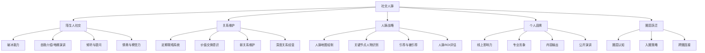

# 🤝 社交人脉能力域

> 你的净资产 ≈ 你最常来往的 5 个人的平均值。

## 能力树

## 各等级标准

### L1 小白
- ✅ 日常朋友圈正常社交
- ❌ 不敢主动认识陌生人
- ❌ 人脉圈基本都是同事/同学
- ❌ 没有个人品牌意识

### L2 入门
- ✅ 能在社交场合自我介绍
- ✅ 参加过行业活动/聚会
- ✅ LinkedIn/脉脉有 200+ 联系人
- ❌ 没有系统的人脉维护方法

### L3 熟练
- ✅ 有跨行业的人脉（不只是技术圈）
- ✅ 每月至少 2 次有目的的社交
- ✅ 有自己的"标签"和被认知的专业形象
- ✅ 认识 3+ 能帮你做事的"关键人"

### L4 精通
- ✅ 能组织高质量活动/社群
- ✅ 经常被引荐给他人
- ✅ 个人品牌有线上影响力（粉丝/读者/学生）
- ✅ 有 2+ 不同圈层的深度连接

### L5 大师
- ✅ 是圈子里的"节点人物"
- ✅ 一个电话能解决大部分问题
- ✅ 有个人 IP / 被行业认知
- ✅ 资源整合能力强，能做"中间人"

---

## 程序员突破社交的实操策略

### 从技术圈开始、但不止于技术圈

| 阶段 | 行动 | 目标 |
|------|------|------|
| 第 1 月 | 每周参加 1 次线下活动 | 练破冰，降低社交焦虑 |
| 第 2-3 月 | 加入 2 个非技术社群（投资/创业） | 拓宽圈层 |
| 第 4-6 月 | 开始做内容输出（公众号/小红书/视频） | 建立个人标签 |
| 第 7-12 月 | 主动约见 3 个高价值人脉 | 建立深度关系 |

### 社交心法
1. **先给价值，再要回报** — 社交不是索取，是投资
2. **数量不如质量** — 100 个点赞之交不如 3 个真朋友
3. **弱关系才是机会来源** — 你已知的信息都在强关系圈里
4. **社交是技能，可以练** — 不是天生外向才能社交

### 人脉维护系统
- **A 级人脉**（5-10 人）：每月联系一次，深度交流
- **B 级人脉**（20-30 人）：每季度联系，节日问候
- **C 级人脉**（100+ 人）：朋友圈互动，偶尔点赞评论

---

## 我的当前状态

- **当前等级**：L_
- **最大障碍**：
- **我的人脉构成**：
  - 技术圈：____%
  - 商业圈：____%
  - 投资圈：____%
  - 其他：____%
- **下一步行动**：
  1. 
  2. 
  3. 
