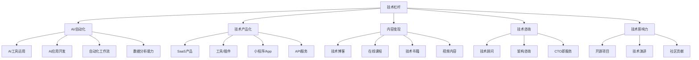

# ⚡ 技术杠杆能力域

> 大多数程序员用技术换时薪，高手用技术建印钞机。

## 核心理念

```
时薪模式：你的收入 = 单价 × 时间（线性增长）
杠杆模式：你的收入 = 产品 × 用户数（指数增长）
```

## 能力树



## 各等级标准

### L1 — 纯打工
- ✅ 能完成分配的技术任务
- ❌ 收入 = 工资
- ❌ 没想过技术还能怎么赚钱

### L2 — 有意识
- ✅ 做过技术副业（接私活等）
- ✅ 有技术博客/GitHub 项目
- ✅ 开始学习 AI 工具提效
- ❌ 副业收入 < 主业的 20%

### L3 — 有产出
- ✅ 有持续产出的技术副业
- ✅ 至少有 1 个技术产品/内容在变现
- ✅ 能用 AI 工具 10x 提升效率
- ✅ 副业收入 = 主业的 30-50%

### L4 — 有系统
- ✅ 有 2+ 个被动收入来源
- ✅ 技术产品有稳定用户群
- ✅ 被认知为某技术领域的专家
- ✅ 能用技术解决非技术人的问题

### L5 — 有平台
- ✅ 技术收入 > 工作收入
- ✅ 有技术品牌/IP
- ✅ 有团队运作技术产品
- ✅ 能做技术投资/孵化

---

## 技术变现路径（按投入/回报排序）

| 路径 | 启动门槛 | 时间投入 | 被动收入潜力 | 推荐 |
|------|---------|---------|------------|------|
| GPTs/AI Agent 开发 | ⭐ | 低 | 中 | 🔥 现在就做 |
| 技术短视频/直播 | ⭐ | 中 | 高 | 🔥 流量红利 |
| Chrome 插件 / VS Code 扩展 | ⭐⭐ | 低 | 中 | 好的起步 |
| 小程序/工具网站 | ⭐⭐ | 中 | 中 | 练手 |
| SaaS 产品 | ⭐⭐⭐ | 高 | 很高 | 长期方向 |
| 技术课程（极客/掘金/B站） | ⭐⭐ | 高 | 高 | 有积累后做 |
| 技术咨询/顾问 | ⭐⭐⭐ | 中 | 低（主动收入） | 以战养战 |
| 开源 + 商业化 | ⭐⭐⭐ | 很高 | 很高 | 长期主义 |

---

## AI 时代的程序员杠杆

### 你的 AI 能力清单

| 级别 | 能力 | 掌握？ |
|------|------|--------|
| 基础 | 用 ChatGPT/Claude 写代码 | ☐ |
| 基础 | 用 Copilot/Cursor 加速开发 | ☐ |
| 进阶 | 用 AI 做数据分析 | ☐ |
| 进阶 | 开发 AI Agent / Workflow | ☐ |
| 进阶 | Fine-tune 模型解决垂直问题 | ☐ |
| 高级 | 用 AI 做产品（AI-native 产品） | ☐ |
| 高级 | AI + 行业 = 解决方案 | ☐ |

---

## 我的当前状态

- **当前等级**：L_
- **现有技术资产**（博客/开源/产品）：
- **副业收入**：____/月
- **下一步行动**：
  1. 
  2. 
  3. 
