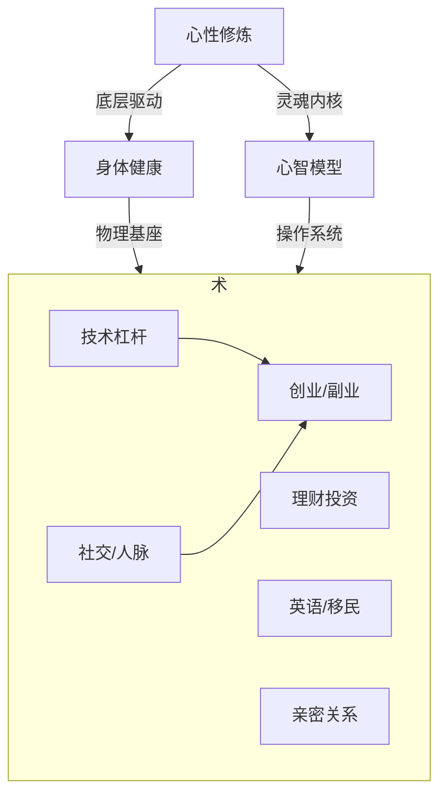

# 🔍 差距分析与优先级排序

> 评估完能力等级后，用本模板找出最值得投入的突破方向。

## 优先级排序公式

```
优先级得分 = 影响力(1-5) × 紧迫度(1-5) × 可行性(1-5)
```

- **影响力**：这项能力提升后对财富/人生自由度的贡献有多大？
- **紧迫度**：不提升这项能力，短期内会有什么后果？
- **可行性**：以你当前的资源和环境，提升这项能力有多容易？

---

## 差距分析表

| 能力域 | 当前 | 目标 | 差距 | 影响力 | 紧迫度 | 可行性 | 优先级得分 | 排名 |
|--------|------|------|------|--------|--------|--------|-----------|------|
| 💪 身体健康 | L_ | L_ | | /5 | /5 | /5 | | |
| 💰 理财投资 | L_ | L_ | | /5 | /5 | /5 | | |
| 🌍 英语移民 | L_ | L_ | | /5 | /5 | /5 | | |
| 🤝 社交人脉 | L_ | L_ | | /5 | /5 | /5 | | |
| ❤️ 亲密关系 | L_ | L_ | | /5 | /5 | /5 | | |
| 👔 管理领导 | L_ | L_ | | /5 | /5 | /5 | | |
| 🚀 创业能力 | L_ | L_ | | /5 | /5 | /5 | | |
| ⚡ 技术杠杆 | L_ | L_ | | /5 | /5 | /5 | | |
| 🧠 心智模型 | L_ | L_ | | /5 | /5 | /5 | | |
| 🧘 心性修炼 | L_ | L_ | | /5 | /5 | /5 | | |

---

## TOP 3 突破方向

### 🥇 第 1 优先：_______________
- **为什么是它**：
- **具体目标**：从 L_ → L_
- **关键行动**（3个以内）：
  1. 
  2. 
  3. 
- **预计时间**：___ 个月
- **所需资源**：
- **如何衡量成功**：

### 🥈 第 2 优先：_______________
- **为什么是它**：
- **具体目标**：从 L_ → L_
- **关键行动**：
  1. 
  2. 
  3. 
- **预计时间**：___ 个月

### 🥉 第 3 优先：_______________
- **为什么是它**：
- **具体目标**：从 L_ → L_
- **关键行动**：
  1. 
  2. 
  3. 
- **预计时间**：___ 个月

---

## 能力复利分析

> 有些能力之间有"复利效应"，提升一个会带动另一个



### 高复利能力（优先投入）
1. **自律系统** — 几乎是所有能力域的地基
2. **勇气/厚脸皮** — 社交和创业的催化剂
3. **技术杠杆** — 程序员的天然优势，可用于加速其他域

> [!TIP]
> 当两个能力域优先级得分相近时，选择**复利效应更大**的那个。
