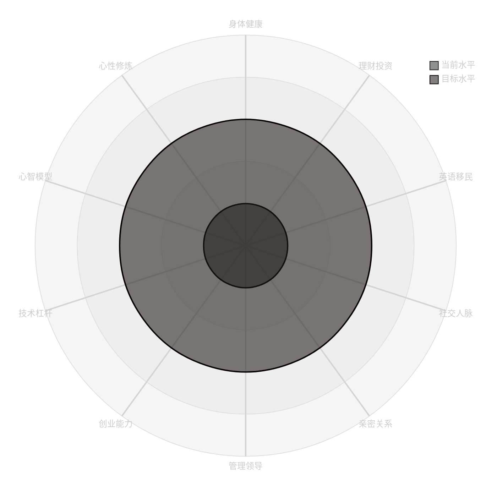
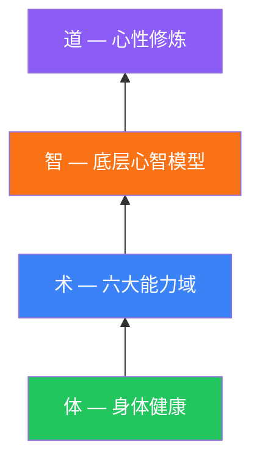

# 📊 能力矩阵总览

> 最后评估：____-__-__ | 下次评估：____-__-__
3: 
4: > [!CAUTION]
5: > **深度反思警告**：本矩阵涉及深层架构思考，建议**每月或每季度**更新一次。
6: > 如果你只是想记录日常习惯，请使用 [⚛️ 微习惯追踪器](../02-action-plans/atomic-habits.md)，避免产生管理疲劳。

## 评估等级说明

| 等级 | 名称 | 定义 | 标志性证据 |
|------|------|------|-----------|
| L1 | 小白 | 知道这个领域存在 | 看过几篇文章/视频 |
| L2 | 入门 | 有基础认知和初步实践 | 小规模尝试过，有初步经验 |
| L3 | 熟练 | 能稳定产出结果 | 有可复现的成功案例 |
| L4 | 精通 | 能教别人、能规模化 | 被人请教/有团队/有收入 |
| L5 | 大师 | 行业影响力、系统化输出 | 有品牌/被动收入/公众认知 |

---

## 能力雷达图（当前状态）

> **使用说明**：根据你的自我评估结果，修改上方雷达图中 `当前水平` 的数值（1-5），`目标水平` 设为你 1 年内想达到的等级。

---

## 能力矩阵评分表

### 体 — 物理基座

| # | 能力域 | 当前等级 | 目标等级 | 差距 | 优先级 | 详细拆解 |
|---|--------|---------|---------|------|--------|---------|
| 0 | 💪 身体健康 | L_ | L_ | | | [→ 详情](domains/health-body.md) |

### 术 — 六大能力域

| # | 能力域 | 当前等级 | 目标等级 | 差距 | 优先级 | 详细拆解 |
|---|--------|---------|---------|------|--------|---------|
| 1 | 💰 理财投资 | L_ | L_ | | | [→ 详情](domains/investment.md) |
| 2 | 🌍 英语移民 | L_ | L_ | | | [→ 详情](domains/english-immigration.md) |
| 3 | 🤝 社交人脉 | L_ | L_ | | | [→ 详情](domains/social-networking.md) |
| 4 | ❤️ 亲密关系与家庭 | L_ | L_ | | | [→ 详情](domains/relationships-family.md) |
| 5 | 👔 管理领导力 | L_ | L_ | | | [→ 详情](domains/management-leadership.md) |
| 6 | 🚀 创业能力 | L_ | L_ | | | [→ 详情](domains/entrepreneurship.md) |
| 7 | ⚡ 技术杠杆 | L_ | L_ | | | [→ 详情](domains/tech-leverage.md) |

### 智 — 底层心智模型

| # | 能力域 | 当前等级 | 目标等级 | 差距 | 优先级 | 详细拆解 |
|---|--------|---------|---------|------|--------|---------|
| 8 | 🧠 底层心智模型 | L_ | L_ | | | [→ 详情](domains/mental-models.md) |

### 道 — 心性修炼

| # | 子域 | 当前等级 | 目标等级 | 差距 | 优先级 | 详细拆解 |
|---|------|---------|---------|------|--------|---------|
| 9a | 🧭 价值观信仰 | L_ | L_ | | | [→ 详情](domains/character-spirit.md#价值观与信仰) |
| 9b | ⚔️ 性格锻造 | L_ | L_ | | | [→ 详情](domains/character-spirit.md#性格锻造) |
| 9c | 🪞 人性弱点 | L_ | L_ | | | [→ 详情](domains/character-spirit.md#克服人性弱点) |
| 9d | 🌊 情绪管理 | L_ | L_ | | | [→ 详情](domains/character-spirit.md#情绪管理) |
| 9e | 🔒 自律系统 | L_ | L_ | | | [→ 详情](domains/character-spirit.md#自律系统) |
| 9f | 🌸 深层精神品质 | L_ | L_ | | | [→ 详情](domains/character-spirit.md#深层精神品质) |

---

## 四层能力架构

> **体**是地基，**术**是技能，**智**是思维操作系统，**道**是灵魂内核。
> 缺体则能力域打折，缺智则术无法升级，缺道则一切没有方向。

## 能力域权重与投资回报

> 不同阶段，能力域的优先级不同

| 财富阶梯 | 最重要的能力域 | 次要 | 说明 |
|----------|-------------|------|------|
| L1-L2 生存/稳定 | 身体健康、技术杠杆、自律系统 | 理财投资 | 先保住身体和收入 |
| L3 增长 | 理财投资、社交人脉、心智模型 | 英语移民 | 让钱和脑子一起生钱 |
| L4 杠杆 | 创业能力、管理领导力 | 性格锻造、亲密关系 | 建系统，需要勇气和后方稳定 |
| L5 自由 | 英语移民、价值观信仰 | 深层精神品质 | 全球化布局，明确活着的意义 |
| L6 富足 | 心性修炼（全部） | 亲密关系与家庭 | 心性决定上限，家庭决定幸福 |

---

## 历史评分记录

| 评估日期 | 健康 | 投资 | 英语 | 社交 | 关系 | 管理 | 创业 | 技术 | 心智 | 心性 | 总评 |
|----------|------|------|------|------|------|------|------|------|------|------|------|
| | L_ | L_ | L_ | L_ | L_ | L_ | L_ | L_ | L_ | L_ | |
