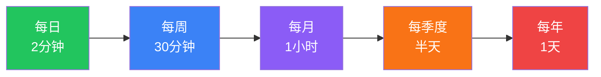

# 🔄 迭代指南与复盘流程

> 没有复盘的迭代不是迭代，是重复。

## 迭代节奏



---

## 每日微复盘（2 分钟）

> 睡前完成，写在日记本/备忘录里

1. 今天做的最有价值的 1 件事是什么？
2. 今天浪费时间最多的 1 件事是什么？
3. 明天最重要的 1 件事是什么？

---

## 每周回顾（30 分钟 · 周日）

### ORID 回顾法

| 层级 | 问题 | 本周记录 |
|------|------|---------|
| **O** 客观事实 | 这周发生了什么？做了什么？ | |
| **R** 感受反应 | 这周最触动我的是什么？什么让我焦虑/兴奋？ | |
| **I** 理性思考 | 我学到了什么？有什么启发？ | |
| **D** 决定行动 | 下周我要做什么不同的事？ | |

### 习惯达成率
- 本周习惯完成率：____%
- 未完成项目分析：
- 调整措施：

---

## 每月回顾（1 小时 · 月末）

### PDCA 循环

#### P（Plan）— 本月计划了什么？
- 月初设定的 TOP 3：
  1. 
  2. 
  3. 

#### D（Do）— 实际做了什么？
- 实际完成的：
- 没完成的：
- 计划外做的：

#### C（Check）— 差距在哪？
- 计划 vs 实际的偏差：
- 偏差原因分析：
- 时间去哪了？

#### A（Act）— 下月调整什么？
- 要开始做的：
- 要停止做的：
- 要继续做的：

### 能力域检查
- 本月在哪个能力域有进步？证据是什么？
- 本月被忽略的能力域：
- 下月要聚焦的能力域：

---

## 每季度大复盘（半天 · 季末）

### 步骤

1. **回顾季度 OKR**
   - 打开 `00-vision/quarterly-objectives.md`
   - 逐项评估完成情况
   
2. **更新能力矩阵评分**
   - 打开 `01-competency-matrix/assessment-template.md`
   - 重新做一次完整评估
   - 和上季度对比，记录变化
   
3. **更新差距分析**
   - 打开 `01-competency-matrix/gap-analysis.md`
   - 重新排序优先级
   
4. **制定下季度计划**
   - 更新 `00-vision/quarterly-objectives.md`
   - 更新 `02-action-plans/current-quarter.md`
   
5. **记录进化日志**
   - 更新 `03-iteration/evolution-log.md`

### 季度复盘模板

在 `03-iteration/reviews/` 下创建新文件：`YYYY-QN.md`

```markdown
# YYYY QN 复盘

## 能力等级变化
| 能力域 | 季初 | 季末 | 变化 | 关键事件 |
|--------|------|------|------|---------|

## 最大的 3 个进步
1. 
2. 
3. 

## 最大的 3 个失败/教训
1. 
2. 
3. 

## 关键认知更新
- 

## 下季度 TOP 3 目标
1. 
2. 
3. 
```

---

## 每年总复盘（1 天 · 年末）

### 年度大问题
1. 这一年我离财务自由近了多少？
2. 我的人脉质量提升了吗？
3. 我的心性有什么变化？
4. 如果今年重来，我会做什么不同的选择？
5. 明年最重要的 1 件事是什么？

### 年度能力进化对比
> 用雷达图对比年初 vs 年末的能力等级

---

## 评分更新触发条件

> 不只是按时间触发，以下事件也应该触发评分更新

| 事件 | 可能影响的能力域 |
|------|---------------|
| 完成了一笔投资（盈利/亏损） | 理财投资 |
| 通过了英语考试 | 英语移民 |
| 认识了一位高价值人脉 | 社交人脉 |
| 带领团队完成了一个项目 | 管理领导力 |
| 上线了一个副业产品 | 创业能力、技术杠杆 |
| 成功控制了一次情绪爆发 | 情绪管理 |
| 连续 30 天坚持了一个习惯 | 自律系统 |
| 做了一件非常害怕的事 | 性格锻造 |
