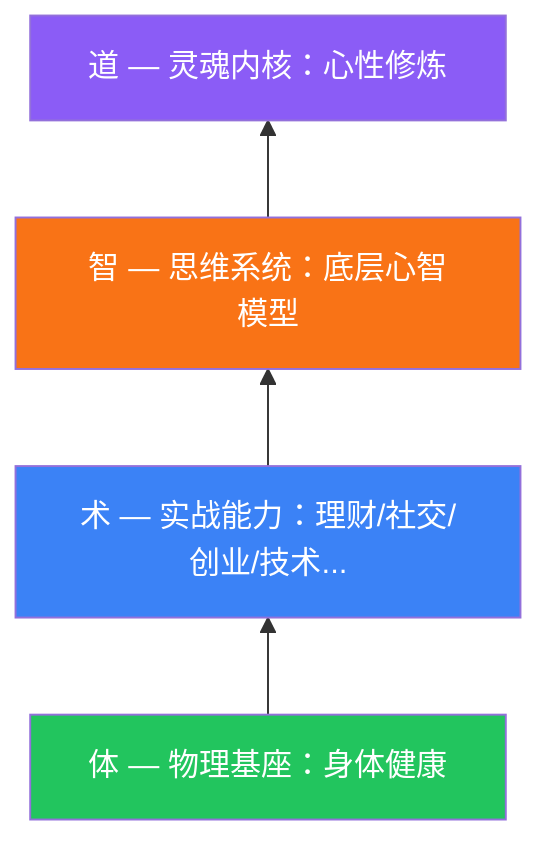

# Life Architect 个人演化系统 — 最终成果展示

> "你的成就，是你认知的套现；而你的认知，由你的心性支撑。"

经过深度迭代，Life Architect 已经从一个简单的能力矩阵演进为一个**多维人生架构系统**。

## 1. 核心架构升级：体 / 术 / 智 / 道

系统现已由“五大杠杆”模型全面升级为更具层级感的**四层架构模型**：

### 核心模块分布
- **体（Body）**：`health-body.md` — 解决精力、活力与长寿问题，是所有能力的物理地基。
- **术（Skills）**：七大实战域。新增 `relationships-family.md`，关注后方的稳定与情感支持。
- **智（Mindset）**：`mental-models.md` — 12 个核心心智模型，提供思维的操作系统，提升决策胜率。
- **道（Character）**：`character-spirit.md` — 心性评估与修炼。新增“深层精神品质”章节（耐心、谦卑、感恩、向死而生等）。

## 2. 成果概览 (10 大能力域)

| 层次 | 能力域 | 关键内容 |
|------|--------|---------|
| **体** | [身体健康](file:///d:/life-architect/01-competency-matrix/domains/health-body.md) | 运动、营养、睡眠、精力管理、长期健康规划 |
| **术** | [理财投资](file:///d:/life-architect/01-competency-matrix/domains/investment.md) | 资产配置、二级市场、财商教育、风险管理 |
| **术** | [英语移民](file:///d:/life-architect/01-competency-matrix/domains/english-immigration.md) | 听说读写、全球化思维、移民路径分析 |
| **术** | [社交人脉](file:///d:/life-architect/01-competency-matrix/domains/social-networking.md) | 建立连接、深度维护、个人品牌、圈层跃迁 |
| **术** | [亲密关系](file:///d:/life-architect/01-competency-matrix/domains/relationships-family.md) | 伴侣经营、家庭目标、原生家庭认知、子女教育 |
| **术** | [管理领导](file:///d:/life-architect/01-competency-matrix/domains/management-leadership.md) | 团队组建、战略思维、决策力、影响力 |
| **术** | [创业能力](file:///d:/life-architect/01-competency-matrix/domains/entrepreneurship.md) | 商业模式、产品开发、销售营销、合规经营 |
| **术** | [技术杠杆](file:///d:/life-architect/01-competency-matrix/domains/tech-leverage.md) | AI 赋能、产品化能力、内容变现、副业探索 |
| **智** | [心智模型](file:///d:/life-architect/01-competency-matrix/domains/mental-models.md) | 系统思维、概率思维、反馈回路、反脆弱、复利 |
| **道** | [心性修炼](file:///d:/life-architect/01-competency-matrix/domains/character-spirit.md) | 价值观锚点、性格锻造、情绪管理、深层灵性 |

## 3. 闭环系统工具集

除了能力详述文件，系统还包含了一套完整的工具链：

1.  **评估与分析**：
    - [评分总览](file:///d:/life-architect/01-competency-matrix/matrix-overview.md) — 包含 10 维雷达图和权重分配指南。
    - [反思模板](file:///d:/life-architect/01-competency-matrix/assessment-template.md) — 证据导向的深度自评表。
    - [差距分析](file:///d:/life-architect/01-competency-matrix/gap-analysis.md) — 优先级排序公式（影响力 × 紧迫度 × 可行性）。

2.  **执行与计划**：
    - [季度 OKR](file:///d:/life-architect/00-vision/quarterly-objectives.md) 与 [当前季度行动计划](file:///d:/life-architect/02-action-plans/current-quarter.md)。
    - [每周习惯跟踪](file:///d:/life-architect/02-action-plans/weekly-habits.md) — 将宏大目标拆解为微小习惯。

3.  **迭代与成长**：
    - [迭代指南](file:///d:/life-architect/03-iteration/iteration-guide.md) — 提供日/周/月/季/年五级复盘流程。
    - [进化日志](file:///d:/life-architect/03-iteration/evolution-log.md) — 专注于记录认知升级和重大关卡突破。

## 4. 体系特色

- **程序员友好**：大量使用 Markdown 结构、Mermaid 图表、逻辑模型（权重、反馈回路、技术杠杆）。
- **极度完整**：不仅有“术”，更有“道”和“体”，确保长期主义的成功。
- **中国视角**：在理财、创业、社交域加入了大量针对中国市场和职场的实战建议。
- **动态演进**：通过 `03-iteration` 模块，系统本身可以通过复盘不断优化，而非静态文档。

---

## 5. 立即开始你的第一步

1.  阅读 [README](file:///d:/life-architect/README.md) 了解全貌。
2.  在 [life-vision.md](file:///d:/life-architect/00-vision/life-vision.md) 中描绘你的北极星。
3.  使用 [assessment-template.md](file:///d:/life-architect/01-competency-matrix/assessment-template.md) 完成一次诚实的全身扫描。
4.  根据 [gap-analysis.md](file:///d:/life-architect/01-competency-matrix/gap-analysis.md) 的打分，找出你这季度的 🥇 **第 1 优先突破口**。

祝你在进化的路上走的扎实、活得通透。
